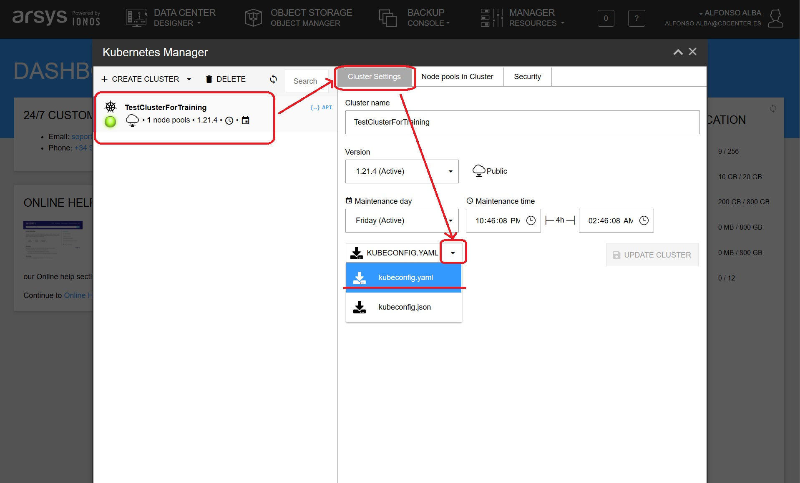

# Configuración de `kubeconfig` para cluster de Arsys

Todos los comandos están ejecutados utilizando esta carpeta como ruta de trabajo.

Entorno de ejecución del taller: `DCD Arsys`

## Descarga del fichero de configuración

Una vez hemos configurado nuestro cluster dentro del Data Center, debemos descargarnos
el fichero de configuración `kubeconfig.yaml`. Para descargarlo hacemos clic en
el menú superior _Manager Resources_ -> _Kubernetes Manager_. Seleccionamos a la izquierda
el cluster del que nos queremos bajar el fichero `kubeconfig.yaml`:



Guardamos el fichero en la carpeta `~/.kube` con el nombre `config_arsys.yml`.

## Configuración de la variable KUBECONFIG

### Linux

Editamos el fichero de configuración de nuestra shell (`~/.bashrc`, `~/.bash_profile` 
o `~/.zshrc`) y añadimos estas líneas

```shell
export KUBECONFIG="$HOME/.kube/config:$HOME/.kube/config_arsys.yml"
```

Para hacer activa la configuración puedes utilizar el comando `source`, cerrar la 
sesión y volver a acceder al sistema o ejecutar ese mismo comando en tu terminal. 
Podemos confirmar que la variable está correctamente aplicada ejecutando

```shell
> echo $KUBECONFIG
/home/user/.kube/config:/home/user/.kube/config_arsys.yml
```

### Windows

Utilizamos el comando `setx` para fijar la variable de entorno:

```Powershell
> setx KUBECONFIG "%USERPROFILE%\.kube\config;%USERPROFILE%\.kube\config_arsys.yml"

SUCCESS: Specified value was saved.
```

Abrimos un nuevo terminal y verificamos que la variable está presente:

```Powershell
> $env:KUBECONFIG
C:\Users\aalba\.kube\config;C:\Users\aalba\.kube\config_arsys.yml
```

## Obtener los contextos

Para obtener los contextos sobre los que podemos trabajar ejecutamos el comando

```shell
$  kubectl config get-contexts
CURRENT   NAME                                   CLUSTER                  AUTHINFO        NAMESPACE
          cluster-admin@TestClusterForTraining   TestClusterForTraining   cluster-admin
*         minikube                               minikube                 minikube        default
```

En el ejemplo, vemos que el contexto activo es el correspondiente a Minikube

## Cambiar de contexto

Vamos a obtener el listado de nodos de nuestro cluster en el nodo que tenemos en el
Centro de datos de Arsys. Para ello ejecutamos el siguiente comando:

```shell
$  kubectl --context=cluster-admin@TestClusterForTraining get nodes
NAME                       STATUS   ROLES   AGE     VERSION
standardnodes-4f4ljvhwzz   Ready    node    11d     v1.21.4
standardnodes-hfi32gbj2x   Ready    node    4d19h   v1.21.4
standardnodes-u3st3sao4j   Ready    node    4d19h   v1.21.4
```

Con la opción `--context`, le indicamos al comando `kubectl` sobre qué cluster queremos ejecutar
las operaciones.

Para evitar el escribir constantemente el contexto sobre el que vamos a operar,
podemos configurar `kubectl` para que cambie el contexto actual:

```shell
$ kubectl config use-context cluster-admin@TestClusterForTraining
Switched to context "cluster-admin@TestClusterForTraining".

 kubectl config get-contexts
CURRENT   NAME                                   CLUSTER                  AUTHINFO        NAMESPACE
*         cluster-admin@TestClusterForTraining   TestClusterForTraining   cluster-admin
          minikube                               minikube                 minikube        default
```

A partir de este momento, todas la operaciones se ejecutarán sobre 
`cluster-admin@TestClusterForTraining`.

