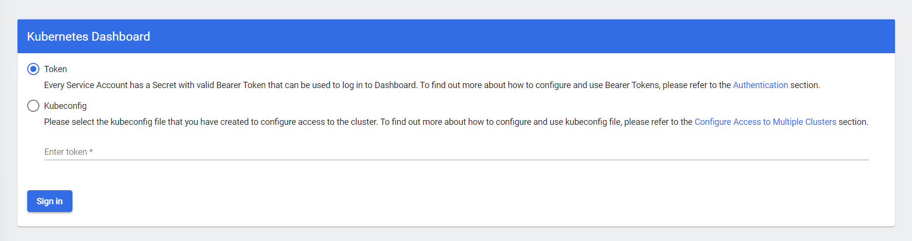

# Instalando el panel de control

Todos los comandos están ejecutados utilizando esta carpeta como ruta de trabajo.

Entorno de ejecución del taller: `managed`

## Namespace

El panel de control se instalará en el espacio de nombres `kubernetes-dashboard`. No necesitamos
crearlo nosotros ya que se creará cuando apliquemos el manifiesto de instalación de la aplicación.

## Instalación

Seguiremos las instrucciones de instalación que se dan en el repositorio de la aplicación:

```shell
$ kubectl apply -f https://raw.githubusercontent.com/kubernetes/dashboard/v2.5.0/aio/deploy/recommended.yaml
namespace/kubernetes-dashboard created
serviceaccount/kubernetes-dashboard created
service/kubernetes-dashboard created
secret/kubernetes-dashboard-certs created
secret/kubernetes-dashboard-csrf created
secret/kubernetes-dashboard-key-holder created
configmap/kubernetes-dashboard-settings created
role.rbac.authorization.k8s.io/kubernetes-dashboard created
clusterrole.rbac.authorization.k8s.io/kubernetes-dashboard created
rolebinding.rbac.authorization.k8s.io/kubernetes-dashboard created
clusterrolebinding.rbac.authorization.k8s.io/kubernetes-dashboard created
deployment.apps/kubernetes-dashboard created
service/dashboard-metrics-scraper created
deployment.apps/dashboard-metrics-scraper created
```

## Crear un usuario

El panel de control de kubernetes viene de serie con una configuración mínima de seguridad que 
nos obliga a crear un usuario para poder acceder al panel.

El primer paso, por lo tanto, será 
[crear el usuario](https://github.com/kubernetes/dashboard/blob/master/docs/user/access-control/creating-sample-user.md):

* Creamos una cuenta de servicio:
  ```shell
  $ kubectl create -f service-account.yml
  serviceaccount/admin-user created
  ```
* Creamos el usuario con el `ClusterRole` `cluster-admin`:
  ```shell
  $ kubectl create -f .\cluster-admin.yml 
  clusterrolebinding.rbac.authorization.k8s.io/admin-user created
  ```

Una vez creado, generaremos un token para poder autenticarnos contra el panel de control
```shell
$ kubectl -n kubernetes-dashboard get secret $(kubectl -n kubernetes-dashboard get sa/admin-user -o jsonpath="{.secrets[0].name}") -o go-template="{{.data.token | base64decode}}"
eyJhbGciOiJSUzI1NiIsImtpZCI6IkIteUxrT21PbU1lQ2NRZVN4MUxPTXFyTU1RTWNjNDRKUmo5R.........
```

## Acceder al panel

Para acceder al panel utilizamores el comando 
[`kubectl proxy`](https://kubernetes.io/docs/reference/generated/kubectl/kubectl-commands#proxy)


```shell
$ kubectl proxy
Starting to serve on 127.0.0.1:8001
```

Para acceder al panel, utilizamos la siguiente URL:

[http://localhost:8001/api/v1/namespaces/kubernetes-dashboard/services/https:kubernetes-dashboard:/proxy/](http://localhost:8001/api/v1/namespaces/kubernetes-dashboard/services/https:kubernetes-dashboard:/proxy/)

En la pantalla de acceso, seleccionamos la opción `Token` y pegamos el token que hemos generado en 
la sección anterior:



## Minikube

Para acceder al panel desde minikube, ejecutamos:

```shell
$ minikube dashboard
```