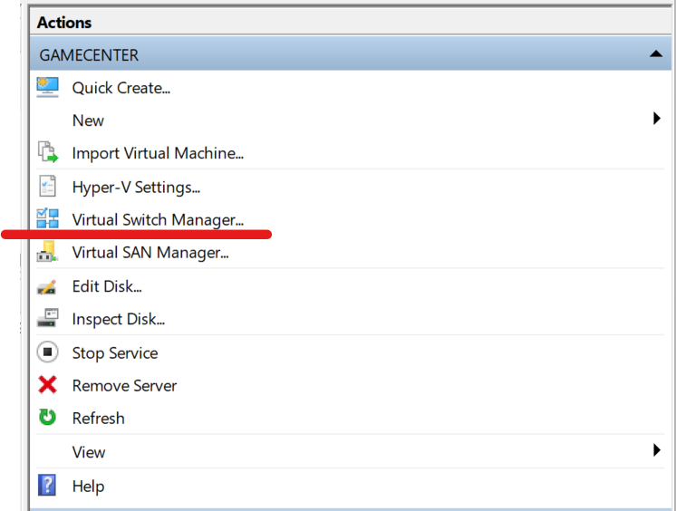
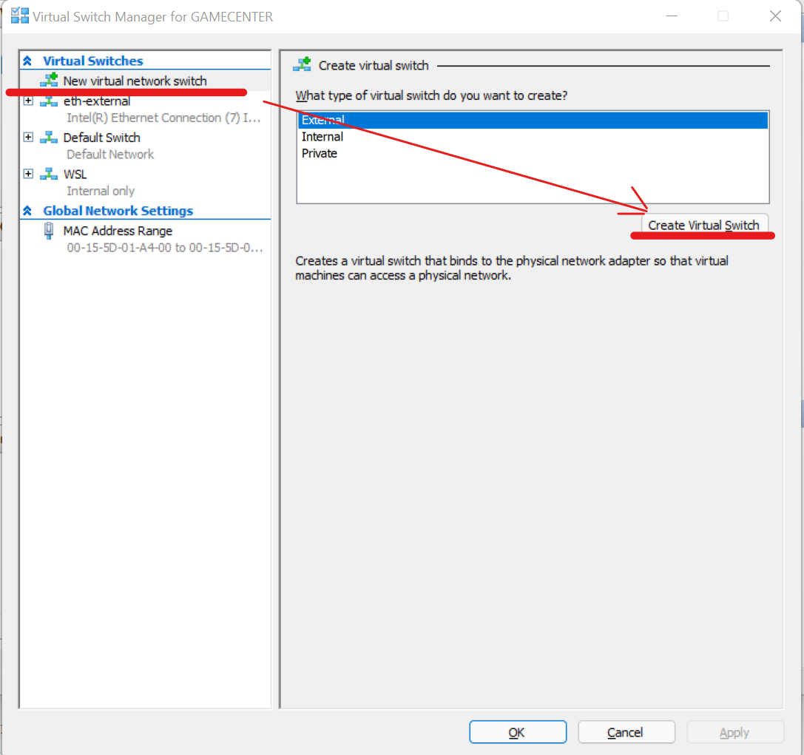
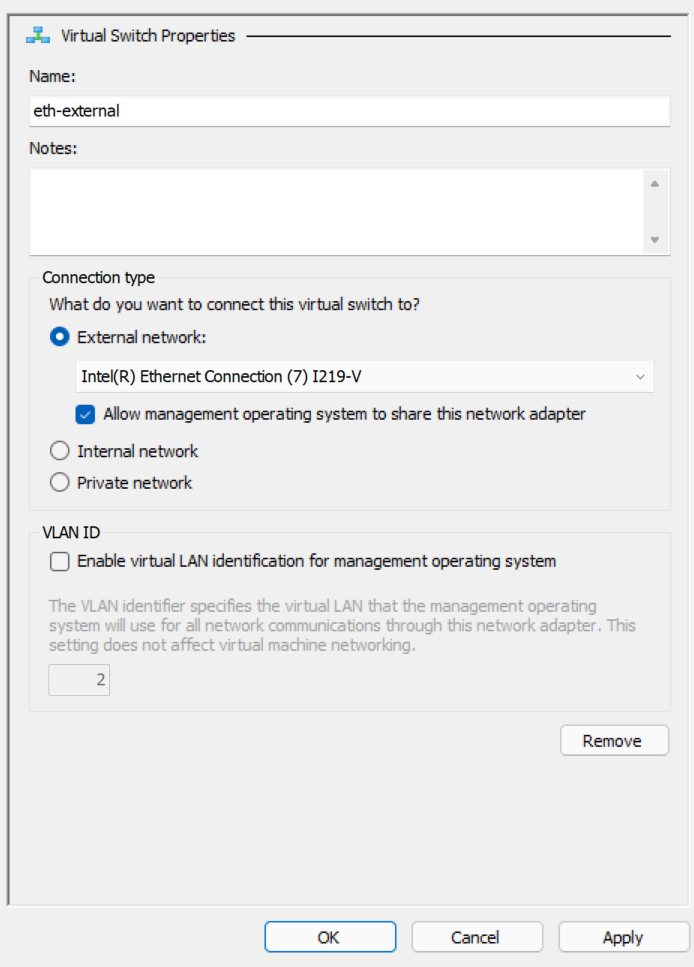

# Instalación de Minikube en Windows

## Instalación de choco

[`chocolatey`](https://chocolatey.org/) es una aplicación que automatiza la instalación, 
actualización y desinstalación de software en systemas Windows.

Está diseñado para ser utilizado por herramientas de automatización como Ansible, Puppet o Chef 
Facilita la gestión de software de Windows dentro de los flujos de trabajo DevOps.

Seguiremos los pasos de instalación descritos en la [página de `chocolatey`](https://chocolatey.org/install).

* Abre una terminal `PowerShell` con permiso de administrador
* Antes de ejecutar el comando que viene a continuación, revisa el script de instalación en 
  [https://community.chocolatey.org/install.ps1](https://community.chocolatey.org/install.ps1)
* Como administrador, ejecuta el siguiente comando

  ```PowerShell
  C:\Windows\system32 > Set-ExecutionPolicy Bypass -Scope Process -Force; [System.Net.ServicePointManager]::SecurityProtocol = [System.Net.ServicePointManager]::SecurityProtocol -bor 3072; iex ((New-Object System.Net.WebClient).DownloadString('https://community.chocolatey.org/install.ps1'))
  ```

  <details>
    <summary>Salida del comando</summary>
    <pre>
        Forcing web requests to allow TLS v1.2 (Required for requests to Chocolatey.org)
        Getting latest version of the Chocolatey package for download.
        Not using proxy.
        Getting Chocolatey from https://community.chocolatey.org/api/v2/package/chocolatey/0.11.3.
        Downloading https://community.chocolatey.org/api/v2/package/chocolatey/0.11.3 to C:\Users\aalba\AppData\Local\Temp\chocolatey\chocoInstall\chocolatey.zip
        Not using proxy.
        Extracting C:\Users\aalba\AppData\Local\Temp\chocolatey\chocoInstall\chocolatey.zip to C:\Users\aalba\AppData\Local\Temp\chocolatey\chocoInstall
        Installing Chocolatey on the local machine
        Creating ChocolateyInstall as an environment variable (targeting 'Machine')
        Setting ChocolateyInstall to 'C:\ProgramData\chocolatey'
        WARNING: It's very likely you will need to close and reopen your shell
        before you can use choco.
        Restricting write permissions to Administrators
        We are setting up the Chocolatey package repository.
        The packages themselves go to 'C:\ProgramData\chocolatey\lib'
        (i.e. C:\ProgramData\chocolatey\lib\yourPackageName).
        A shim file for the command line goes to 'C:\ProgramData\chocolatey\bin'
        and points to an executable in 'C:\ProgramData\chocolatey\lib\yourPackageName'.

        Creating Chocolatey folders if they do not already exist.

        WARNING: You can safely ignore errors related to missing log files when
        upgrading from a version of Chocolatey less than 0.9.9.
        'Batch file could not be found' is also safe to ignore.
        'The system cannot find the file specified' - also safe.
        chocolatey.nupkg file not installed in lib.
        Attempting to locate it from bootstrapper.
        PATH environment variable does not have C:\ProgramData\chocolatey\bin in it. Adding...
        ADVERTENCIA: Not setting tab completion: Profile file does not exist at
        'C:\Users\aalba\Documents\WindowsPowerShell\Microsoft.PowerShell_profile.ps1'.
        Chocolatey (choco.exe) is now ready.
        You can call choco from anywhere, command line or powershell by typing choco.
        Run choco /? for a list of functions.
        You may need to shut down and restart powershell and/or consoles
        first prior to using choco.
        Ensuring Chocolatey commands are on the path
        Ensuring chocolatey.nupkg is in the lib folder
      </pre>
    </details>
* En la misma consola, en la que seguimos siendo administradores, instalamos `minikube`
  
  ```PowerShell
  C:\Windows\system32 > choco install minikube
  ```

  <details>
    <summary>Salida del comando</summary>
    <pre>
        Chocolatey v0.11.3
        Installing the following packages:
        minikube
        By installing, you accept licenses for the packages.
        Progress: Downloading kubernetes-cli 1.23.1... 100%
        Progress: Downloading Minikube 1.24.0... 100%

        kubernetes-cli v1.23.1 [Approved]
        kubernetes-cli package files install completed. Performing other installation steps.
        The package kubernetes-cli wants to run 'chocolateyInstall.ps1'.
        Note: If you don't run this script, the installation will fail.
        Note: To confirm automatically next time, use '-y' or consider:
        choco feature enable -n allowGlobalConfirmation
        Do you want to run the script?([Y]es/[A]ll - yes to all/[N]o/[P]rint): Y

        Extracting 64-bit C:\ProgramData\chocolatey\lib\kubernetes-cli\tools\kubernetes-client-windows-amd64.tar.gz to C:\ProgramData\chocolatey\lib\kubernetes-cli\tools...
        C:\ProgramData\chocolatey\lib\kubernetes-cli\tools
        Extracting 64-bit C:\ProgramData\chocolatey\lib\kubernetes-cli\tools\kubernetes-client-windows-amd64.tar to C:\ProgramData\chocolatey\lib\kubernetes-cli\tools...
        C:\ProgramData\chocolatey\lib\kubernetes-cli\tools
        ShimGen has successfully created a shim for kubectl-convert.exe
        ShimGen has successfully created a shim for kubectl.exe
        The install of kubernetes-cli was successful.
        Software installed to 'C:\ProgramData\chocolatey\lib\kubernetes-cli\tools'

        Minikube v1.24.0 [Approved]
        minikube package files install completed. Performing other installation steps.
        ShimGen has successfully created a shim for minikube.exe
        The install of minikube was successful.
        Software install location not explicitly set, it could be in package or
        default install location of installer.

        Chocolatey installed 2/2 packages.
        See the log for details (C:\ProgramData\chocolatey\logs\chocolatey.log).
    </pre>
  </details>

  La instalación de `minikube` nos instala también el comando `kubectl` (cortesía
  del gestor de dependencias de `chocolatey`).

* Verificamos que está todo correctamente instalado

  ```PowerShell
  PS C:\Windows\system32> kubectl version
  Client Version: version.Info{Major:"1", Minor:"23", GitVersion:"v1.23.1", GitCommit:"86ec240af8cbd1b60bcc4c03c20da9b98005b92e", GitTreeState:"clean", BuildDate:"2021-12-16T11:41:01Z", GoVersion:"go1.17.5", Compiler:"gc", Platform:"windows/amd64"}
  Unable to connect to the server: dial tcp [::1]:8080: connectex: No se puede establecer una conexión ya que el equipo de destino denegó expresamente dicha conexión.
  
  PS C:\Windows\system32> minikube version
  minikube version: v1.24.0
  commit: 76b94fb3c4e8ac5062daf70d60cf03ddcc0a741b
  ```

## Preparación de la máquina virtual en Hyper-V

Minikube puede utilizar multitud de [drivers](https://minikube.sigs.k8s.io/docs/drivers/) para 
levantar el nodo. Hyper-V, VirtualBox, Hyperkit, KVM2, VMWare Fusion, VMWare Workstation...
también puede emular el funcionamiento del nodo usando Docker / Podman.

En nuestro caso, y para facilitar la coexistencia con Docker Desktop For Windows, utilizaremos
el driver Hyper-V.

Mi experiencia con este driver es buena y el nodo es muy rápido a la hora de ejecutar los talleres
del curso. El único problema que me he encontrado es cuando se utilizan algunos programas
de protección contra Virus y Malware que incluyen un cortafuegos. En estos casos, he necesitado
crear un _Virtual Switch_ en Hyper-V para que minikube configure la red correctamente.

Abrir el programa `Hyper-V Manager`. En el panel _Actions_ hacer click sobre _Virtual Switch Manager_.




En la ventana que se abre, seleccionar la opción _New virtual network switch_. Seleccionar _External_ 
y después hacer click en _Create virtual Switch_.



Introcudir el nombre (`eth-external`), seleccionar el interfaz de red y aplicar los cambios



Con esto, hemos terminado la configuración de Hyper-V.

## Crear el nodo

Abrir una sesión en una consola `PowerShell` con permiso de administrador. En ella, ejecutamos:

```PowerShell
C:\Windows\system32 > minikube start --driver=hyperv --hyperv-virtual-switch=eth-external
```
<details>
    <summary>Salida del comando</summary>
    <pre>
    * minikube v1.24.0 en Microsoft Windows 11 Pro 10.0.22000 Build 22000
    - KUBECONFIG=C:\Users\youruser\.kube\config
    * Using the hyperv driver based on user configuration
    * Starting control plane node minikube in cluster minikube
    * Creando hyperv VM (CPUs=2, Memory=6000MB, Disk=20000MB) ...
    * Preparando Kubernetes v1.22.3 en Docker 20.10.8...
    - Generating certificates and keys ...
    - Booting up control plane ...
    - Configuring RBAC rules ...
    * Verifying Kubernetes components...
    - Using image gcr.io/k8s-minikube/storage-provisioner:v5
    * Complementos habilitados: storage-provisioner, default-storageclass
    * Done! kubectl is now configured to use "minikube" cluster and "default" namespace by default
    </pre>
</details>

Podemos verificar que todo ha funcionado correctamente ejecutando:

```PowerShell
C:\WINDOWS\system32 > minikube status
minikube
type: Control Plane
host: Running
kubelet: Running
apiserver: Running
kubeconfig: Configured
```

Y conectándonos a la máquina virtual por ssh:

```text
C:\WINDOWS\system32 > minikube ssh
                         _             _
            _         _ ( )           ( )
  ___ ___  (_)  ___  (_)| |/')  _   _ | |_      __
/' _ ` _ `\| |/' _ `\| || , <  ( ) ( )| '_`\  /'__`\
| ( ) ( ) || || ( ) || || |\`\ | (_) || |_) )(  ___/
(_) (_) (_)(_)(_) (_)(_)(_) (_)`\___/'(_,__/'`\____)

$ whoami
docker
$
```

Llegados a este punto, ya estamos listos para ejecutar en minikube los siguientes
laboratorios del curso.

## Limpieza

Siempre que quieras puedes borrar la máquina virtual ejecutando como administrador:

```PowerShell
C:\WINDOWS\system32 > minikube delete
```

Eso si, recuerda que al hacerlo perderás toda la configuración que tuvieses ya hecha
del cluster de Kubernetes.

Igualmente, si deseas eliminar el propio minikube, puedes utilizar choco para hacerlo:

 ```PowerShell
 C:\WINDOWS\system32> choco uninstall minikube kubernetes-cli
 ```