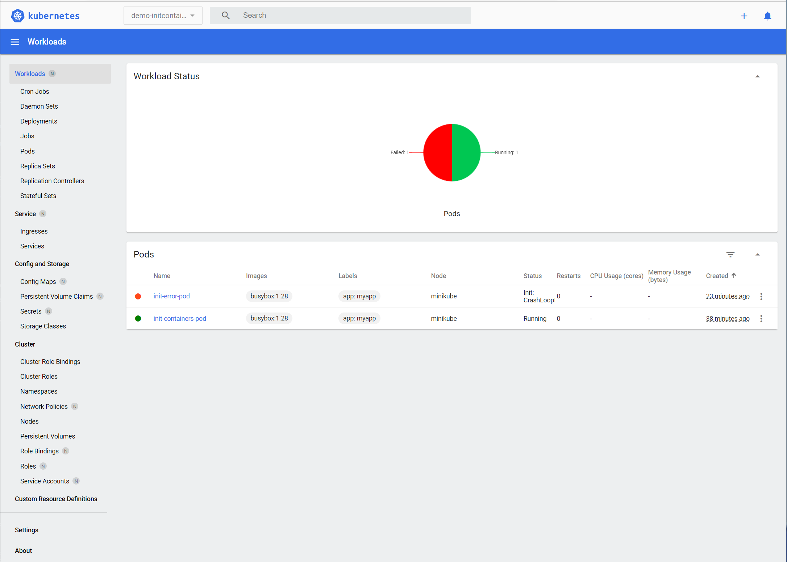

# Ciclo de vida del `Pod`: _init containers_

Todos los comandos están ejecutados utilizando esta carpeta como ruta de trabajo.

Entorno de ejecución del taller: `minikube`


## `Namespace`

Para la realización de este taller utilizaremos el espacio de nombres `demo-initcontainers`:

```shell
$ kubectl create -f namespace.yml
namespace/demo-initcontainers created
```

Verificamos la creación del espacio de nombres:

```shell
$ kubectl get namespaces
NAME                STATUS   AGE
default             Active   34d
demo-initcontainers Active   14s
kube-node-lease     Active   34d
kube-public         Active   34d
kube-system         Active   34d
```

Puedes seleccionar este espacio de nombres por defecto ejecutando:

```shell
$ kubectl config set-context --current --namespace demo-initcontainers
Context "minikube" modified.
```

## El `Pod`

Utilizaremos el `Pod` [`pod.yml`](./pod.yml) para mostrar cómo funcionan los contenedores 
de inicialización. Este `Pod` de ejemplo tiene dos contenedores que se ejecutan antes de que la
aplicación se levante:


```shell
$ kubectl apply -f pod.yml
```

Una vez creado el `Pod` ejecutaremos varias veces siguiente comando para ver el estado en el 
que se encuentran los contenedores:

```shell
$ kubectl get pod init-containers-pod -n demo-initcontainers  -o yaml
```

Unos segundos después de ejecutar el comando, podemos ver que el `Pod` está en la fase `Pending`
y que el primer contenedor de inicialización se está ejecutando:

```yaml
status:
  conditions: ...
  containerStatuses:
  - image: busybox:1.28
    imageID: ""
    lastState: {}
    name: the-application
    ready: false
    restartCount: 0
    started: false
    state:
      waiting:
        reason: PodInitializing
  initContainerStatuses:
  - containerID: docker://57a0feb186efd86fe418327f435b10f53b23812c995ff5f2dc13112c7c5da254
    image: busybox:1.28
    imageID: docker-pullable://busybox@sha256:141c253bc4c3fd0a201d32dc1f493bcf3fff003b6df416dea4f41046e0f37d47 
    lastState: {}
    name: init-myservice
    ready: false
    restartCount: 0
    state:
      running:
        startedAt: "2022-02-15T04:38:34Z"
  - image: busybox:1.28
    imageID: ""
    lastState: {}
    name: init-database
    ready: false
    restartCount: 0
    state:
      waiting:
        reason: PodInitializing
  phase: Pending
```

Si esperamos un poco más de 20 segundos y volvemos a ejecutar `kubectl get pods...`, veremos cómo 
se empieza a ejecutar el segundo contenedor de inicialización:

```yaml
status:
  conditions: ...
  containerStatuses:
  - image: busybox:1.28
    imageID: ""
    lastState: {}
    name: the-application
    ready: false
    restartCount: 0
    started: false
    state:
      waiting:
        reason: PodInitializing
  initContainerStatuses:
  - containerID: docker://57a0feb186efd86fe418327f435b10f53b23812c995ff5f2dc13112c7c5da254
    image: busybox:1.28
    imageID: docker-pullable://busybox@sha256:141c253bc4c3fd0a201d32dc1f493bcf3fff003b6df416dea4f41046e0f37d47 
    lastState: {}
    name: init-myservice
    ready: true
    restartCount: 0
    state:
      terminated:
        containerID: docker://57a0feb186efd86fe418327f435b10f53b23812c995ff5f2dc13112c7c5da254
        exitCode: 0
        finishedAt: "2022-02-15T04:38:54Z"
        reason: Completed
        startedAt: "2022-02-15T04:38:34Z"
  - containerID: docker://e2eb4ed373b4aecfa82c883db611bb3c2c73c96762d36b305902f056967807f4
    image: busybox:1.28
    imageID: docker-pullable://busybox@sha256:141c253bc4c3fd0a201d32dc1f493bcf3fff003b6df416dea4f41046e0f37d47 
    lastState: {}
    name: init-database
    ready: false
    restartCount: 0
    state:
      running:
        startedAt: "2022-02-15T04:38:54Z"
  phase: Pending
```

Si esperamos a que pasen 40 segundos, veremos cómo se comienza a ejecutar la aplicación:

```yaml
  containerStatuses:
  - containerID: docker://5a65fbfc94906cbe3bc7245eef36ec8a83385066f4e2a185ff06b0d1c4f7b5d9
    image: busybox:1.28
    imageID: docker-pullable://busybox@sha256:141c253bc4c3fd0a201d32dc1f493bcf3fff003b6df416dea4f41046e0f37d47 
    lastState: {}
    name: the-application
    ready: true
    restartCount: 0
    started: true
    state:
      running:
        startedAt: "2022-02-15T04:39:15Z"
  hostIP: 192.168.1.160
  initContainerStatuses:
  - containerID: docker://57a0feb186efd86fe418327f435b10f53b23812c995ff5f2dc13112c7c5da254
    image: busybox:1.28
    imageID: docker-pullable://busybox@sha256:141c253bc4c3fd0a201d32dc1f493bcf3fff003b6df416dea4f41046e0f37d47 
    lastState: {}
    name: init-myservice
    ready: true
    restartCount: 0
    state:
      terminated:
        containerID: docker://57a0feb186efd86fe418327f435b10f53b23812c995ff5f2dc13112c7c5da254
        exitCode: 0
        finishedAt: "2022-02-15T04:38:54Z"
        reason: Completed
        startedAt: "2022-02-15T04:38:34Z"
  - containerID: docker://e2eb4ed373b4aecfa82c883db611bb3c2c73c96762d36b305902f056967807f4
    image: busybox:1.28
    imageID: docker-pullable://busybox@sha256:141c253bc4c3fd0a201d32dc1f493bcf3fff003b6df416dea4f41046e0f37d47 
    lastState: {}
    name: init-database
    ready: true
    restartCount: 0
    state:
      terminated:
        containerID: docker://e2eb4ed373b4aecfa82c883db611bb3c2c73c96762d36b305902f056967807f4
        exitCode: 0
        finishedAt: "2022-02-15T04:39:14Z"
        reason: Completed
        startedAt: "2022-02-15T04:38:54Z"
  phase: Running

```

## `Pod` con errores de inicialización

Vamos a levantar un segundo `Pod` que tiene un primer contenedor de inicialización con errores.
El fichero de definición es [`pod-with-init-errors.yml`](./pod-with-init-errors.yml).

Al igual que antes, ejecutaremos el siguiente comando varias veces:

```shell
$ kubectl get pod init-error-pod -n demo-initcontainers  -o yaml
```

Este es el estado en el que se encuentra el `Pod` pasados 10 segundos y tras generarse el primer error:

```yaml
status:
  conditions: ...
  containerStatuses:
  - image: busybox:1.28
    imageID: ""
    lastState: {}
    name: the-application
    ready: false
    restartCount: 0
    started: false
    state:
      waiting:
        reason: PodInitializing
  hostIP: 192.168.1.160
  initContainerStatuses:
  - containerID: docker://a5919cc45b5085febcfd8b32ab2295a51ecc9a874798df5740644024da8601da
    image: busybox:1.28
    imageID: docker-pullable://busybox@sha256:141c253bc4c3fd0a201d32dc1f493bcf3fff003b6df416dea4f41046e0f37d47 
    lastState:
      terminated:
        containerID: docker://c6dd5cacc0a952e48c2fd0aaba7497d9c8564d0206e476ee8e4de984976402ee
        exitCode: 10
        finishedAt: "2022-02-15T04:54:06Z"
        reason: Error
        startedAt: "2022-02-15T04:53:46Z"
    name: init-myservice
    ready: false
    restartCount: 1
    state:
      terminated:
        containerID: docker://a5919cc45b5085febcfd8b32ab2295a51ecc9a874798df5740644024da8601da
        exitCode: 10
        finishedAt: "2022-02-15T04:54:27Z"
        reason: Error
        startedAt: "2022-02-15T04:54:07Z"
  - image: busybox:1.28
    imageID: ""
    lastState: {}
    name: init-database
    ready: false
    restartCount: 0
    state:
      waiting:
        reason: PodInitializing
  phase: Pending        
```

A partir del tercer intento, el `Pod` entra en ciclo `CrashLoopBackOff` y los intentos de 
reinicializar el `Pod` se empiezan a separar en el tiempo:

```yaml
status:
  conditions: ...
  containerStatuses:
  - image: busybox:1.28
    imageID: ""
    lastState: {}
    name: the-application
    ready: false
    restartCount: 0
    started: false
    state:
      waiting:
        reason: PodInitializing
  initContainerStatuses:
  - containerID: docker://bc65b5d00fe3d884ee22598bf2180597b4e198126fe3b12f230d1b6807ba8b76
    image: busybox:1.28
    imageID: docker-pullable://busybox@sha256:141c253bc4c3fd0a201d32dc1f493bcf3fff003b6df416dea4f41046e0f37d47 
    lastState:
      terminated:
        containerID: docker://bc65b5d00fe3d884ee22598bf2180597b4e198126fe3b12f230d1b6807ba8b76
        exitCode: 10
        finishedAt: "2022-02-15T04:55:48Z"
        reason: Error
        startedAt: "2022-02-15T04:55:28Z"
    name: init-myservice
    ready: false
    restartCount: 3
    state:
      waiting:
        message: back-off 40s restarting failed container=init-myservice pod=init-error-pod_demo-initcontainers(91de325e-e5e1-4963-9675-87f925f45a76)
        reason: CrashLoopBackOff
  - image: busybox:1.28
    imageID: ""
    lastState: {}
    name: init-database
    ready: false
    restartCount: 0
    state:
      waiting:
        reason: PodInitializing
  phase: Pending  
```

Si esperamos 40 segundos, vemos que el siguiente intento tendrá lugar dentro de tres minutos:

```yaml
status:
  conditions: ...
  containerStatuses:
  - image: busybox:1.28
    imageID: ""
    lastState: {}
    name: the-application
    ready: false
    restartCount: 0
    started: false
    state:
      waiting:
        reason: PodInitializing
  initContainerStatuses:
  - containerID: docker://bc65b5d00fe3d884ee22598bf2180597b4e198126fe3b12f230d1b6807ba8b76
    image: busybox:1.28
    imageID: docker-pullable://busybox@sha256:141c253bc4c3fd0a201d32dc1f493bcf3fff003b6df416dea4f41046e0f37d47 
    lastState:
      terminated:
        containerID: docker://bc65b5d00fe3d884ee22598bf2180597b4e198126fe3b12f230d1b6807ba8b76
        exitCode: 10
        finishedAt: "2022-02-15T04:55:48Z"
        reason: Error
        startedAt: "2022-02-15T04:55:28Z"
    name: init-myservice
    ready: false
    restartCount: 3
    state:
      waiting:
        message: back-off 2m40s restarting failed container=init-myservice pod=init-error-pod_demo-initcontainers(91de325e-e5e1-4963-9675-87f925f45a76)
        reason: CrashLoopBackOff
  - image: busybox:1.28
    imageID: ""
    lastState: {}
    name: init-database
    ready: false
    restartCount: 0
    state:
      waiting:
        reason: PodInitializing
  phase: Pending 
```

Si listamos los `Pods`, veremos el siguiente estado en el listado:

```shell
$ kubectl get pods -n demo-initcontainers
NAME                  READY   STATUS                  RESTARTS      AGE
init-containers-pod   1/1     Running                 0             24m
init-error-pod        0/1     Init:CrashLoopBackOff   6 (52s ago)   9m2s
```

El `Pod` quedará en este estado de forma permanente, ya que la política de reinicio por 
defecto es `Always` ([ver `restartPolicy`](https://kubernetes.io/docs/reference/kubernetes-api/workload-resources/pod-v1/#lifecycle))

Si abrimos el panel de control de Kubernetes, veremos el `Pod` que está dando errores:



## Limpieza

Volvemos a poner `default` como espacio de nombres por defecto:

```shell
$ kubectl config set-context --current --namespace default
Context "minikube" modified.
```


Para borrar todos los objetos, basta con borrar el espacio de nombres:

```shell
$ kubectl delete -f namespace.yml
namespace "demo-initcontainers" deleted
```