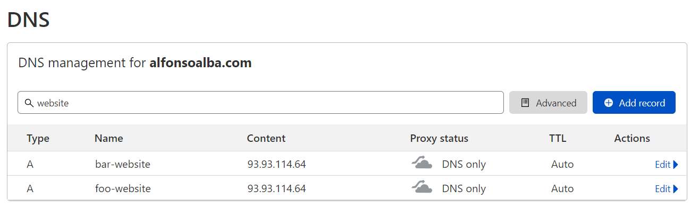

# `Ingress` en un cluster gestionado

Todos los comandos están ejecutados utilizando esta carpeta como ruta de trabajo.

Para este taller es necesario haber instalado el controlador `ingress-nginx` del taller
[Instalar _Ingress Controller_ en un cluster gestionado](../ingress-controller-in-managed-cluster/README_es.md).

Entorno de ejecución del taller: `managed`

## Creación del espacio de nombres

Vamos a desplegar en nuestro cluster las webs de _Foo Corporation_ y _Bar Corporation_ y vamos acceder a ellas
utilizando un objeto `Ingress`.

Lo haremos dentro de un `Namespace`, así que el primer paso será crearlo:

```shell
$ kubectl create -f namespace.yml 
namespace/demo-ingress created
```

Podemos verlo de la siguiente manera:

```shell 
$ kubectl get namespaces -o wide
NAME              STATUS   AGE
default           Active   37h
demo-ingress      Active   82s
ingress-nginx     Active   23m
kube-node-lease   Active   37h
kube-public       Active   37h
kube-system       Active   37h

$ kubectl describe namespace demo-ingress
Name:         demo-ingress
Labels:       kubernetes.io/metadata.name=demo-ingress
Annotations:  <none>
Status:       Active

No resource quota.

No LimitRange resource.
```

Puedes seleccionar este espacio de nombres por defecto ejecutando:

```shell
$ kubectl config set-context --current --namespace demo-ingress
Context "managed" modified.
```


## Creación de los `Deployments`

Una vez tenemos el espacio de nombres creado, procedemos a crear los `Deployments` para cada uno de los sitios web [`deployment-foo.yml`](./deployment-foo.yml) y [`deployment-bar.yml`](./deployment-bar.yml):

```shell
$ kubectl apply -f deployment-bar.yml -f deployment-foo.yml
deployment.apps/bar-website-deployment created
deployment.apps/foo-website-deployment created
```

Veamos los `Deployments` que acabamos de crear:

```shell
$ kubectl get deployments -n demo-ingress
NAME          READY   UP-TO-DATE   AVAILABLE   AGE
bar-website   3/3     3            3           9s
foo-website   3/3     3            3           9s
```

Ya tenemos ambos los `Deployments` con sus respectivos `Pods` listos para recibir tráfico


## Registros DNS

A continuación crearemos dos registros DNS que apuntarán a la dirección IP del `Service` `ingress-nginx-controller`.
Utilizando `kubectl` obtenemos la dirección IP:

```shell
$ kubectl get service ingress-nginx-controller --namespace=ingress-nginx
NAME                       TYPE           CLUSTER-IP      EXTERNAL-IP    PORT(S)                      AGE
ingress-nginx-controller   LoadBalancer   10.233.55.150   93.93.114.64   80:31648/TCP,443:31104/TCP   54m
```

A continuación creamos dos registros DNS que apunten al cluster. Si no dispones de un dominio con el que crear estos registros,
puedes utilizar algú servicio gratuito como noip.com o cloudns.net. En nuestro caso, configuraremos los registros
DNS en cloudflare:



## Creación de los `Servicios`

Necesitaremos crear dos servicios para balancear el tráfico entre los distintos `Pods`. Estos servicios no serán accesibles
desde fuera del cluster directamente, sólo podremos acceder a ellos a través del `ingress-nginx-controller`. Por este
motivo, estos servicios serán de tipo `ClusterIP` (los servicio son [`service-foo.yml`](./service-foo.yml) y [`service-bar.yml`](./service-bar.yml))`:

```shell
$ kubectl apply -f service-foo.yml -f service-bar.yml
service/foo-website created
service/bar-website created
```

Veamos los servicios que acabamos de crear:

```shell
$ kubectl get services -n demo-ingress
NAME          TYPE        CLUSTER-IP      EXTERNAL-IP   PORT(S)   AGE
bar-website   ClusterIP   10.233.52.254   <none>        80/TCP    32s
foo-website   ClusterIP   10.233.26.18    <none>        80/TCP    33s
```

## Creamos el objeto `Ingress`

Recapitulemos. Para cada una de las páginas webs:
* Tenemos un `Deployment` con 3 réplicas
* Hemos creado un `Service` de tipo de `ClusterIP` que nos permite enrutar el tráfico a los `Pods`
* Tenemos un controlador `ingress-nginx` escuchando en el puerto 80 de la dirección IP 93.93.114.64

Sólo nos falta _conectar_ el controlador `ingress-nginx` con los servicios. Esto es lo que se encarga
de hacer el objeto `Ingress`. Creamos el fichero [`ingress.yml`](./ingress.yml). Este fichero contiene
las reglas para enrutar el tráfico. En este caso, las reglas están basadas en el nombre de dominio:

```yaml
...
  rules:
  - host: foo-website.alfonsoalba.com
    http:
      paths:
      - path: /*
        pathType: Prefix
        backend:
          service:
            name: foo-website
            port:
              number: 80
  - host: bar-website.alfonsoalba.com
...
```

Creamos el objeto `Ingress`:

```shell
$ kubectl apply -f ingress.yml
ingress.networking.k8s.io/demo-ingress created
```

Veamos el objeto:

```shell
$ kubectl describe ingress demo-ingress -n demo-ingress
Name:             demo-ingress
Labels:           <none>
Namespace:        demo-ingress
Address:          93.93.114.64
Default backend:  default-http-backend:80 (<error: endpoints "default-http-backend" not found>)
Rules:
  Host                         Path  Backends
  ----                         ----  --------
  foo-website.alfonsoalba.com
                               /*   foo-website:80 (10.214.40.122:80,10.221.166.14:80,10.221.166.2:80)
  bar-website.alfonsoalba.com
                               /*   bar-website:80 (10.214.40.122:80,10.221.166.14:80,10.221.166.2:80)
Annotations:                   <none>
Events:
  Type    Reason  Age                    From                      Message
  ----    ------  ----                   ----                      -------
  Normal  Sync    5m19s (x2 over 5m31s)  nginx-ingress-controller  Scheduled for sync
```

Apunta tu navegador a [http://foo-website.alfonsoalba.com](http://foo-website.alfonsoalba.com) o [http://bar-website.alfonsoalba.com](http://bar-website.alfonsoalba.com). Puede que
necesites abrir las páginas en una ventana con navegación privada debido a la configuración
HSTS del dominio que estamos utilizando.
## Limpieza

Para limpiar, borramos el espacio de nombres:

```kubectl
$  kubectl delete namespace demo-ingress
namespace "demo-ingress" deleted
```

Borrar los registros DNS creados.