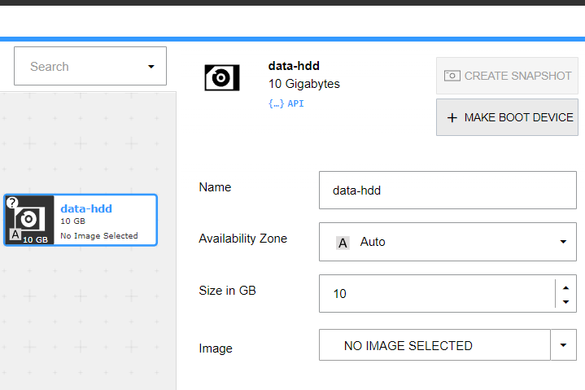
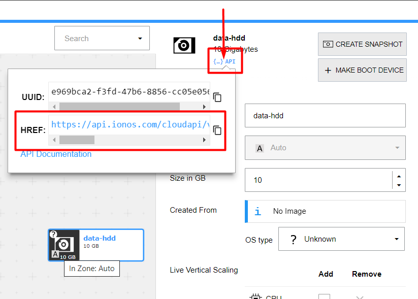

# Arsys: Uso de `PersistentVolume` y `PersistentVolumeClaim`

Todos los comandos están ejecutados utilizando esta carpeta como ruta de trabajo.

Entorno de ejecución del taller: `managed`

## `Namespace`

Para la realización de este taller utilizaremos el espacio de nombres `demo-pvandpvc`:

```shell
$ kubectl create -f namespace.yml
namespace/demo-pvandpvc created
```

Verificamos la creación del espacio de nombres:

```shell
$ kubectl get namespaces
NAME                STATUS   AGE
default             Active   34d
demo-pvandpvc       Active   16s
kube-node-lease     Active   34d
kube-public         Active   34d
kube-system         Active   34d
```

Puedes seleccionar este espacio de nombres por defecto ejecutando:

```shell
$ kubectl config set-context --current --namespace demo-pvandpvc
Context "managed" modified.
```
## Creación del volumen físico

Accedemos al DCD y creamos un disco HDD arrastrándolo al DataCenter. Le asignaremos un espacio de 10G y le pondremos como nombre `data-hdd`:



Una vez creado el disco, aprovisionar los cambios en el DataCenter. Cuando el
disco se haya aprovisionado, necesitaremos obtener la siguiente información:
* UUID del datacenter
* URL para acceder al disco a través de la API. La necesitaremos para 
  configurar el parámetro `VolumeHandle`

La URL podemos obtenerla de esta manera:



En el mi caso, el disco tiene la siguiente URL:

```text
https://api.ionos.com/cloudapi/v6/datacenters/3914a457-f19b-4bba-8742-b21fa61d4521/volumes/e969bca2-f3fd-47b6-8856-cc05e0564417
```

De esta URL podemos obtener:
* DataCenter UUID: 3914a457-f19b-4bba-8742-b21fa61d4521
* `VolumeHandle`: quedarese con la parte de la URL que va desde `datacenters` hasta
el final: `datacenters/3914a457-f19b-4bba-8742-b21fa61d4521/volumes/e969bca2-f3fd-47b6-8856-cc05e0564417`

Con estos datos, creamos el fichero de definición [`persistent-volume`](./persistent-volume.yml)

```shell
kubectl apply -f persistent-volume.yml
persistentvolume/shared-data-volume configured
```

Comprobamos que el `PersistentVolume` se ha creado correctamente:

```shell
$ kubectl get pv                  
NAME                  CAPACITY   ACCESS MODES   RECLAIM POLICY   STATUS      CLAIM           STORAGECLASS           REASON   AGE
shared-data-volume    10Gi       RWO            Delete           Available                   ionos-enterprise-hdd            4m26s
```

El `PersistentVolume` queda en estado `Available` hasta que algún `Pod` lo reclame.

## `PersistentVolumeClaim`

Para utilizar el volumen que acabamos de crear dentro de un `Pod`, creamos un `PersistentVolumeClaim`. 
Este está definido en el fichero [`persistent-volume-claim.yml`](./persistent-volume-claim.yml).

Podemos ver el objeto `PersistentVolumeClaim` que acabamos de crear:

```shell
$ kubectl get pvc -n demo-pvandpvc
NAME                STATUS   VOLUME               CAPACITY   ACCESS MODES   STORAGECLASS           AGE
shared-data-claim   Bound    shared-data-volume   10Gi       RWO            ionos-enterprise-hdd   31s
```

Como vemos, el estado de este objeto es `Bound`. Si listamos de nuevo el `PersistentVolume`, veremos que 
el este pasa de estado `Available` a `Bound`. Además, veremos el `Claim` que se ha enlazado a este volumen:

```shell
$ kubectl get pv -n demo-pvandpvc
NAME                  CAPACITY   ACCESS MODES   RECLAIM POLICY   STATUS   CLAIM                             STORAGECLASS           REASON   AGE
shared-data-volume    10Gi       RWO            Delete           Bound    demo-pvandpvc/shared-data-claim   ionos-enterprise-hdd            21m
```

## Accediendo al volumen desde un `Pod`

Especificamos un `Pod` que use el `PersistentVolumeClaim` y lo monte como un volumen. Puedes ver este  `Pod` en el fichero
[`pod.yml`](./pod.yml).

Creamos el `Pod`:

```shell
$ kubectl apply -f pod.yml
pod/test-pod created
```

Podemos ver el `Pod` que acabamos de crear:

```shell
$ kubectl get pods -n demo-pvandpvc
NAME       READY   STATUS    RESTARTS   AGE
test-pod   1/1     Running   0          49s
```

Si mostramos la información del `Pod`, veremos que el volumen montado:

```shell
$ kubectl describe pods test-pod -n demo-pvandpvc
Name:         test-pod
Namespace:    demo-pvandpvc
...
Status:       Running
...
Containers:
  nginx:
    Container ID:   containerd://43d7cc68c9ab165e6abdb6b9c3b45b5b9a1fc28530af819acfd8df8f17483901
    Image:          nginx
...
    Mounts:
      /mnt/shared-data from shared-data-volume (rw)
      /var/run/secrets/kubernetes.io/serviceaccount from kube-api-access-6g729 (ro)
...
Volumes:
  shared-data-volume:
    Type:       PersistentVolumeClaim (a reference to a PersistentVolumeClaim in the same namespace)
    ClaimName:  shared-data-claim
    ReadOnly:   false
  kube-api-access-6g729:
    Type:                    Projected (a volume that contains injected data from multiple sources)
    TokenExpirationSeconds:  3607
    ConfigMapName:           kube-root-ca.crt
    ConfigMapOptional:       <nil>
    DownwardAPI:             true
Events:
  Type    Reason                  Age   From                     Message
  ----    ------                  ----  ----                     -------
  Normal  Scheduled               97s   default-scheduler        Successfully assigned demo-pvandpvc/test-pod to standardnodes-tsl5rq2g7y
  Normal  SuccessfulAttachVolume  88s   attachdetach-controller  AttachVolume.Attach succeeded for volume "shared-data-volume"
  Normal  Pulling                 63s   kubelet                  Pulling image "nginx"
  Normal  Pulled                  62s   kubelet                  Successfully pulled image "nginx" in 1.217179388s
  Normal  Created                 62s   kubelet                  Created container nginx
  Normal  Started                 62s   kubelet                  Started container nginx
```

Podemos crear un fichero en el volumen para verificar que tenemos acceso de escritura en el volumen:

```shell
$ kubectl exec test-pod -n demo-pvandpvc -- touch /mnt/shared-data/test-file.txt
```

Si miramos el objeto `PersisntentVolumeClaim`, vemos cómo está siendo utilizado por el `Pod` `test-pod`:

```shell
 kubectl describe pvc shared-data-claim -n demo-pvandpvc         
Name:          shared-data-claim
Namespace:     demo-pvandpvc
StorageClass:  ionos-enterprise-hdd
Status:        Bound
Volume:        shared-data-volume
Labels:        <none>
Annotations:   pv.kubernetes.io/bind-completed: yes
Finalizers:    [kubernetes.io/pvc-protection]
Capacity:      10Gi
Access Modes:  RWO
VolumeMode:    Filesystem
Used By:       test-pod
Events:        <none>
```

## Siguiente paso

En el [siguiente taller](../arsys-failed-persistent-volumes/README_es.md), veremos qué ocurre si borramos el `Pod` y el `PersistentVolumeClaim`.

## Limpieza

---

⚠️ No borres los objetos si vas a realizar el siguiente taller.

---

Volvemos a poner `default` como espacio de nombres por defecto:

```shell
$ kubectl config set-context --current --namespace default
Context "managed" modified.
```


Para borrar todos los objetos, basta con borrar el espacio de nombres:

```shell
$ kubectl delete -f namespace.yml
namespace "demo-pvandpvc" deleted

$ kubectl delete -f persistent-volume.yml
```

Una vez borrados los objetos de Kubernetes, debemos borrar el volumen en el DCD.