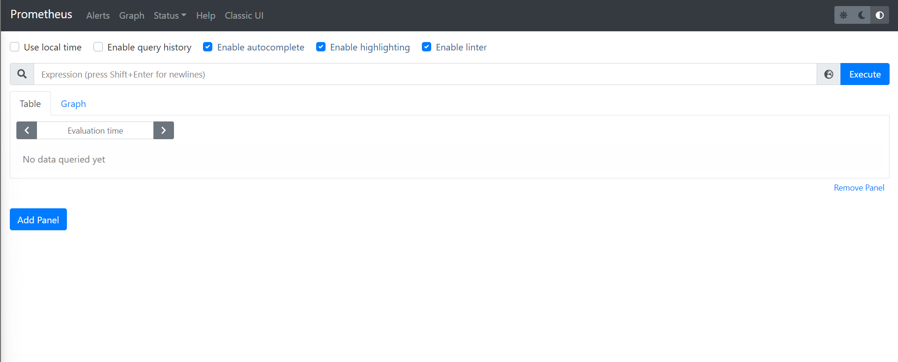

# Instalando prometheus usando Helm

Todos los comandos están ejecutados utilizando esta carpeta como ruta de trabajo.

Entorno de ejecución del taller: `managed`

## `Namespace`

Para la realización de este taller utilizaremos el espacio de nombres `demo-helm`:

```shell
$ kubectl create -f namespace.yml
namespace/demo-helm created
```

Verificamos la creación del espacio de nombres:

```shell
$ kubectl get namespaces
NAME                        STATUS   AGE
default                     Active   34d
demo-helm           Active   12s
kube-node-lease             Active   34d
kube-public                 Active   34d
kube-system                 Active   34d
```

Puedes seleccionar este espacio de nombres por defecto ejecutando:

```shell
$ kubectl config set-context --current --namespace demo-helm
Context "managed" modified.
```
## Instalación de Helm

Instalamos Helm en la máquina virtual que utilizamos para ejecutar el comando `kubectl`.

En la [sección de instalación de la documentación de Helm](https://helm.sh/docs/intro/install/)
se detallan todas las formas de instalación para diferentes sistemas operativos y diferentes
formas de instalación. Para Ubuntu tendremos que ejecutar los siguientes comandos:

```shell
curl https://baltocdn.com/helm/signing.asc | sudo apt-key add -
sudo apt-get install apt-transport-https --yes
echo "deb https://baltocdn.com/helm/stable/debian/ all main" | sudo tee /etc/apt/sources.list.d/helm-stable-debian.list
sudo apt-get update
sudo apt-get install helm
```

Comprobamos que la instalación se ha llevado a cabo correctamente ejecutando:

```shell
$ helm version
version.BuildInfo{Version:"v3.8.0", GitCommit:"d14138609b01886f544b2025f5000351c9eb092e", GitTreeState:"clean", GoVersion:"go1.17.5"}
```

## Buscando el paquete para prometheus

Para instalar prometheus, buscamos en primer lugar el paquete que queramos instalar.
Usando la página web [https://artifacthub.io/](https://artifacthub.io/) buscamos
el paquete oficial de prometheus. Llegaremos a la siguiente página: 
[https://artifacthub.io/packages/helm/prometheus-community/prometheus](https://artifacthub.io/packages/helm/prometheus-community/prometheus)

En esta página se nos facilitan las instrucciones de instalación:

* Añadimos el repositorio
  ```shell
  $ helm repo add prometheus-community https://prometheus-community.github.io/helm-charts
  "prometheus-community" has been added to your repositories
  
  $ helm repo update
  Hang tight while we grab the latest from your chart repositories...
  ...Successfully got an update from the "elastic" chart repository
  ...Successfully got an update from the "prometheus-community" chart repository
  Update Complete. ⎈Happy Helming!⎈
  ```
* Instalamos la versión 15.4.0. Utilizaremos la opción `-n` para instalarlo en el espacio de nombres
  de este taller:
  ```shell
  $ helm install 15.4.0 -n demo-helm prometheus-community/prometheus

  NAME: prometheus
  LAST DEPLOYED: Sat Feb 26 19:36:11 2022
  NAMESPACE: demo-helm
  STATUS: deployed
  REVISION: 1
  TEST SUITE: None
  NOTES:
  The Prometheus server can be accessed via port 80 on the following DNS name from within your cluster:     
  prometheus-server.demo-helm.svc.cluster.local


  Get the Prometheus server URL by running these commands in the same shell:
    export POD_NAME=$(kubectl get pods --namespace demo-helm -l "app=prometheus,component=server" -o jsonpath="{.items[0].metadata.name}")
    kubectl --namespace demo-helm port-forward $POD_NAME 9090


  The Prometheus alertmanager can be accessed via port 80 on the following DNS name from within your cluster:
  prometheus-alertmanager.demo-helm.svc.cluster.local


  Get the Alertmanager URL by running these commands in the same shell:
    export POD_NAME=$(kubectl get pods --namespace demo-helm -l "app=prometheus,component=alertmanager" -o jsonpath="{.items[0].metadata.name}")
    kubectl --namespace demo-helm port-forward $POD_NAME 9093
  #################################################################################
  ######   WARNING: Pod Security Policy has been moved to a global property.  #####
  ######            use .Values.podSecurityPolicy.enabled with pod-based      #####
  ######            annotations                                               #####
  ######            (e.g. .Values.nodeExporter.podSecurityPolicy.annotations) #####
  #################################################################################


  The Prometheus PushGateway can be accessed via port 9091 on the following DNS name from within your cluster:
  prometheus-pushgateway.demo-helm.svc.cluster.local


  Get the PushGateway URL by running these commands in the same shell:
    export POD_NAME=$(kubectl get pods --namespace demo-helm -l "app=prometheus,component=pushgateway" -o jsonpath="{.items[0].metadata.name}")
    kubectl --namespace demo-helm port-forward $POD_NAME 9091

  For more information on running Prometheus, visit:
  https://prometheus.io/
  ```

Una vez terminada la instalación, podemos ver los diferentes objetos que ha instalado este
paquete:

```shell
kubectl get all -n demo-helm
NAME                                                 READY   STATUS    RESTARTS   AGE
pod/prometheus-alertmanager-f68df6679-bx228          2/2     Running   0          101s
pod/prometheus-kube-state-metrics-6c44ff7fb6-ksj6t   1/1     Running   0          101s
pod/prometheus-node-exporter-7hgrp                   1/1     Running   0          101s
pod/prometheus-node-exporter-wjpmf                   1/1     Running   0          101s
pod/prometheus-node-exporter-xjfnp                   1/1     Running   0          101s
pod/prometheus-pushgateway-547877d6cd-nsn96          1/1     Running   0          101s
pod/prometheus-server-5f54d5759-8zzq8                2/2     Running   0          101s

NAME                                    TYPE        CLUSTER-IP     EXTERNAL-IP   PORT(S)    AGE
service/prometheus-alertmanager         ClusterIP   10.233.26.5    <none>        80/TCP     101s
service/prometheus-kube-state-metrics   ClusterIP   10.233.27.45   <none>        8080/TCP   101s
service/prometheus-node-exporter        ClusterIP   None           <none>        9100/TCP   101s
service/prometheus-pushgateway          ClusterIP   10.233.4.29    <none>        9091/TCP   101s
service/prometheus-server               ClusterIP   10.233.6.245   <none>        80/TCP     101s

NAME                                      DESIRED   CURRENT   READY   UP-TO-DATE   AVAILABLE   NODE SELECTOR   AGE
daemonset.apps/prometheus-node-exporter   3         3         3       3            3           <none>          101s

NAME                                            READY   UP-TO-DATE   AVAILABLE   AGE
deployment.apps/prometheus-alertmanager         1/1     1            1           101s
deployment.apps/prometheus-kube-state-metrics   1/1     1            1           101s
deployment.apps/prometheus-pushgateway          1/1     1            1           101s
deployment.apps/prometheus-server               1/1     1            1           101s

NAME                                                       DESIRED   CURRENT   READY   AGE
replicaset.apps/prometheus-alertmanager-f68df6679          1         1         1       101s
replicaset.apps/prometheus-kube-state-metrics-6c44ff7fb6   1         1         1       101s
replicaset.apps/prometheus-pushgateway-547877d6cd          1         1         1       101s
replicaset.apps/prometheus-server-5f54d5759                1         1         1       101s
```

## Accediendo a la interfaz gráfica

Mirando el listado de servicios, vemos que podemos acceder al servidor a través del puerto 
80 del servicio `prometheus-server`. Utilizaremos el comando `kubectl port-forward` para 
acceder a la interfaz web the prometheus:

```shell
kubectl port-forward -n demo-helm service/prometheus-server 8888:80
Forwarding from 127.0.0.1:8888 -> 9090
Forwarding from [::1]:8888 -> 9090
```

Si apuntamos nuestro navegador a http://localhost:8888/, podremos ver la interfaz gráfica:



Podemos ver los paquetes que tenemos instalados usando `helm list`

```shell
helm list -n demo-helm
NAME            NAMESPACE       REVISION        UPDATED                                 STATUS          CHART             APP VERSION
prometheus      demo-helm       1               2022-02-26 19:36:11.010236132 +0000 UTC deployed        prometheus-15.4.0 2.31.1
```

## Limpieza

Volvemos a poner `default` como espacio de nombres por defecto:

```shell
$ kubectl config set-context --current --namespace default
Context "managed" modified.
```

Desinstalamos el paquete usando `helm uninstall`:

```shell
$ helm uninstall prometheus -n demo-helm
release "prometheus" uninstalled
```

Borramos el espacio de nombres:

```shell
$ kubectl delete -f namespace.yml
namespace "demo-helm" deleted
```