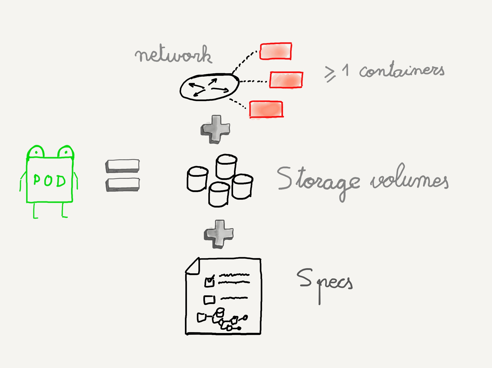

### ¿Qué es un pod?

Unidad mínima que se puede desplegar en un cluster

notes:
En un cluster no se puede desplegar nada más pequeño que un pod.

Imagina una app que solo consta de un contenedor: un sitio web estático
que se sirve a través de un nginx. La forma de desplegar ese 
contenedor es meterlo dentro de un pod.

^^^^^^
### ¿Qué es un pod?

notes:

Un pod consta de:
* Recursos de red, como por ejemplo una dirección IP
* uno o más contenedores
* Volúmenes de almacenacenamiento
* Especificación sobre cómo ejecutar esos contenedores

Todos los recursos de un pod se aprovisionan juntos en un mismo contexto. por
ejemplo, los contenedores que están dentro de un pod pueden llegar de uno
a otro directamente conectándose directamente al puerto del otro contenedor.
