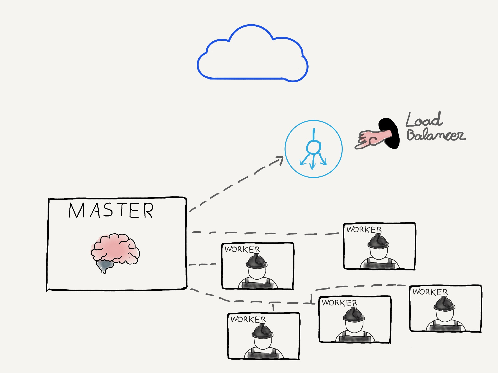

notes:

En esta imagen vemos una representación de un cluster de Kubernetes a muy alto nivel.

Tenemos tres piezas en el puzzle:
* El nodo maestro (_master_): que es la parte "pensante" del cluster. Es el responsable
de gestionar el cluster. Por ejemplo, es el que recibe
las peticiones cuando ejecutamos el comando `kubectl`, las procesa y o bien las ejecuta o las 
distribuye para que sean ejecutadas en los workers. También es el responsable de orquestar
los nodos de trabajo, que es donde nuestras aplicaciones acabarán ejecutándose.
* Los nodos de trabajo (_workers_): son los que se ejecutan los pods. Contienen todos
los servicios necesarios para poder gestionar contenedores, gestionar la red, configurar la comunicación entre contenedores, 
comunicarse con el maestro y asignar recursos a los contenedores de los pods entre otras 
responsabilidades
* Otros elementos: El cluster puede tener acceso a "elementos externos" e integrarse con ellos. 
Por ejemplo, durante el curso veremos que los proveedores de clusters gestionados tienen integrado
sus servicios con Kubernetes. Esta integración permite, por ejemplo, levantar un balanceador de carga o utilizar discos duros
de su infraestrucutra definiendo los recursos dentro de Kubernetes ¡sin necesidad de 
configurarlos nosotros usando sus herramientas! 
Otro ejemplo es `etcd`. Con objeto de implentar
alta disponibilidad en la base de datos `etcd`, se suele montar en un cluster en lugar de utilizar
una única instancia de `etcd` en el nodo maestro.

En las siguientes diapositivas, entraremos un poco más en detalle a ver los servicios y procesos que se
ejecutan en el nodo maestro y los nodos de trabajo.
