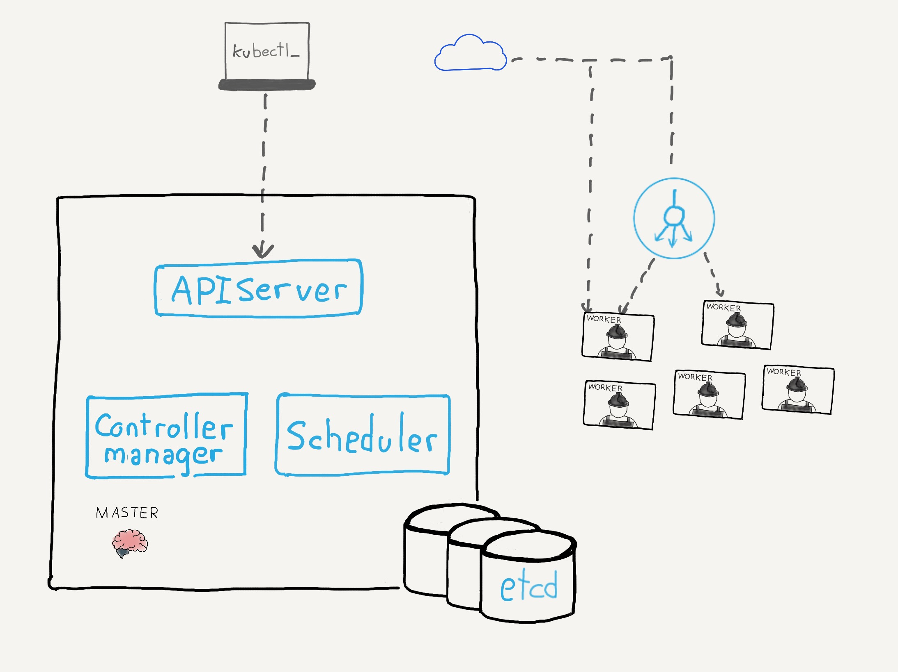

### El nodo maestro

^^^^^^ 

### `etcd`
* [`etcd`](https://etcd.io/) es una base datos clave valor, simple, distribuida y confiable
* Almacena la información del cluster (número de nodos, estado,  `Namespaces`, etc) y objetos de la API
* Solo es accesible desde el <em>API Server</em>
* [ℹ️ Más información](https://kubernetes.io/docs/tasks/administer-cluster/configure-upgrade-etcd)

^^^^^^

### `kube-apiserver`
* *Entidad principal de la gestión del cluster
* Es el _frontend_ del cluster
* Se comunica con `etcd` y se asegura de la consistencia de los datos
* [ℹ️ Más información](https://kubernetes.io/docs/reference/command-line-tools-reference/kube-apiserver/) 

notes: 

Recibe todas las peticiones REST (por ejemplo a través de `kubectl`)
para gestionar los recursos de Kubernetes (Pods, Deployments, Services...). Por eso se dice
que es el _frontend_ del cluster.

_kube-apiserver_ se encarga, cuando escribe en la base de datos `etcd` de que la información
que se almacena es congruente con los que hay en los nodos del cluster.

^^^^^^
### `kube-controller-manager`

* Ejecutar procesos de control en segundo plano
* Consta de varios controladores que se encargan de que el cluster esté en el estado que se desea que esté
  Ejemplos de controladores: replication controller, endpoints controller, namespace controller, y serviceaccounts controller
* [ℹ️ Más información](https://kubernetes.io/docs/reference/command-line-tools-reference/kube-controller-manager/)

notes:

Ejemplos de tareas que esta capa de controladores se encarga de controlar:
* número de réplicas es el que tiene que se
* si se actualiza la imagen de un pod, modifica los nodos para que se despliegue la nueva imagen

^^^^^^

### `cloud-controller-manager`

* Controladores específicos de los proveedores de cloud

* Permite enlazar el cluster con la API del proveedor de servicios en la nube
* [ℹ️ Más información](https://kubernetes.io/docs/concepts/overview/components/#cloud-controller-manager)

^^^^^^

### `kube-scheduler`

* Ayuda a programar los pods y desplegarlos en los nodos teniendo en cuenta:
  * los recursos disponibles de memoria y procesador de los nodos
  * los requisitos de cada pod.

notes:

Por ejemplo, si queremos desplegar un Pod que requiere 2G de memoria RAM y 3 CPUs,
esta componente es la que se encarga de encontrar el nodo adecuado para desplegar
ese Pod.

Por este motivo, esta componente debe saber cuáles son los recursos del cluster disponibles 
tanto en el cluster como en cada uno de los nodos.

Hablaremos mucho del `kube-scheduler` cuando hablemos de autoescalado, `Taints` y `Tolerations`