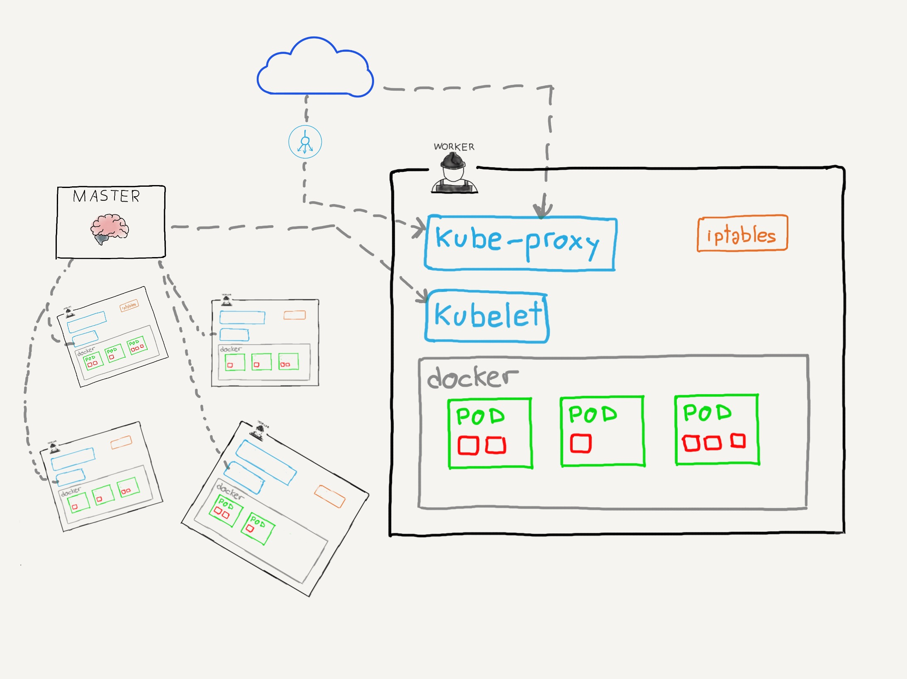

### Nodos de trabajo

  

^^^^^^

### `kubelet`

* Servicio principal que se ejecuta en los nodos
* Responsable de que los pods y sus contenedores estén en el estado deseado
* Informa al nodo maestro del estado del nodo en el que se ejecuta
* [ℹ️ Más información](https://kubernetes.io/docs/reference/command-line-tools-reference/kubelet/)

^^^^^^

`kubelet` funciona mediante `PodSpec`. Un `PodSpec` es un objeto YAML o JSON
que contiene la especificación completa de un Pod. `kubelet` recibe uno o varios
objetos `PodSpec` y se asegura de que los contenedores ejecutados en el nodo cumplen
con esa especificación y están levantados y ejecutándose.

`kubelet` recibe los `PodSpec` desde el `kube-apiserver`, aunque se le pueden cargar
desde un fichero o realizando peticiones HTTP (_Static Pods_)

^^^^^^

### `kubeproxy`

* Se encarga de configurar la red del nodo para que cumpla con la especificación de los objetos `Service` para ese nodo
* *Gestiona las subredes, expone los puertos y reenvía las peticiones a los nodos adecuados del cluster
* Se comunica principalmente con `iptables`
* [ℹ️ Más información](https://kubernetes.io/docs/reference/command-line-tools-reference/kube-proxy/)

^^^^^^

### `kubeproxy`

notes:

En este ejemplo se pueden ver dos ejemplos de cómo funciona kube-proxy. 

* En la petición 1, el tercer nodo recibe una petición a través del balanceador de carga
que va dirigida a uno de los pods del cluster. Utilizando la red interna de ese pod, 
reenvía la petición por esa subred.

* En la petición 2, el primer nodo recibe una petición directa que debe servirse por un
pod que está situado en el nodo 2. `kube-proxy` reenvía la petición al nodo correcto, que
a su vez la reenvía al pod a través de la subred de ese nodo.
