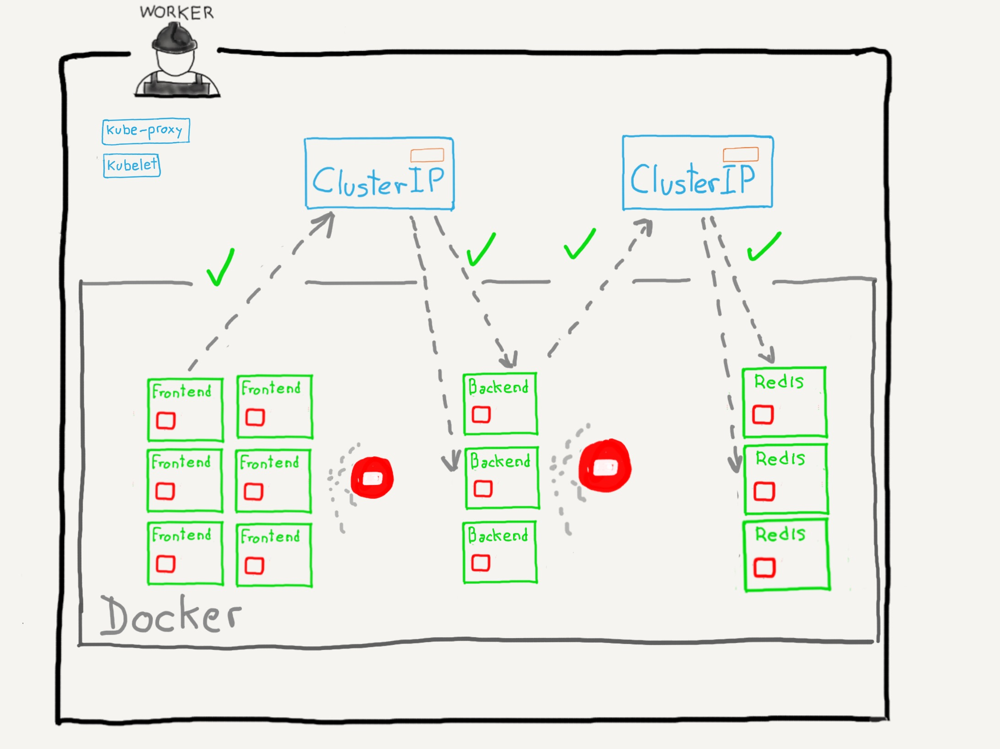
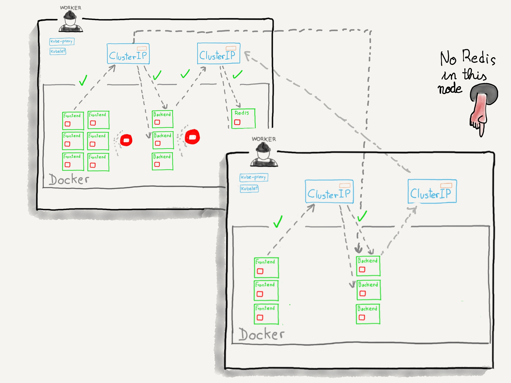
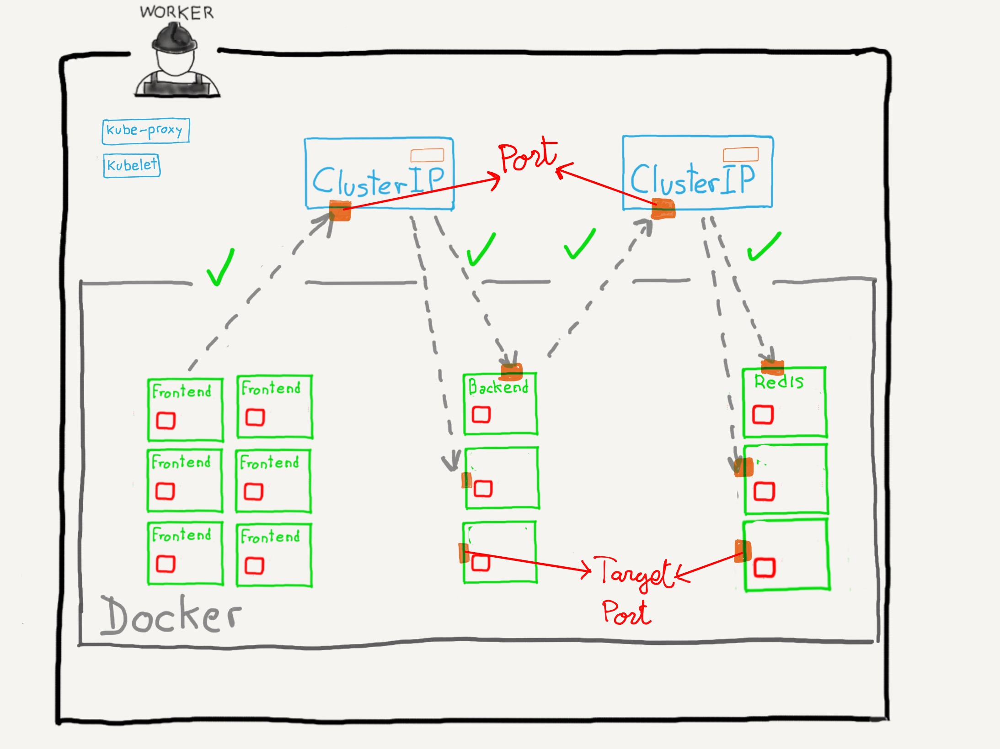

### Tipos de servicios

* _ClusterIP_
* _NodePort_
* _LoadBalancer_
* _ExternalName_

Note:

En esta sección veremos los cuatro tipos de servicios que se pueden definir dentro
de Kubernetes.

------

### `ClusterIP`



Note:

¡Una imagen vale más que mil palabras!

Un servicio de tipo `ClusterIP` provee de conexión de red dentro del cluster.
**A este tipo de servicios no se accede normalmente desde el exterior del cluster**

Como hemos comentado en la sección anterior, los Pods son mortales. En el ejemplo
que he puesto en esta diapositiva, no tendría que nuestros frontales
se conectasen directamente a los _backends_ ya que estos pueden desaparecen en 
cualquier momento.

En lugar de eso, utilizamos un servicio de tipo ClusterIP. Los frontales se
conectan a este servicio, que reenvía las peticones a los Pods con los backends.
Este servicio sabe en qué estado están esos Pods y si alguno de ellos ha sido
programado para ser eliminado o no está respondiendo a peticiones, no le envía
más peticiones.

^^^^^^

### `ClusterIP`



Note:

Los servicios con capaces de enrutar el tráfico entre diferentes nodos. Todo
esto se hace internamente a través de `iptables`.

Siguiendo con el ejemplo anterior, supongamos que aumenta el tráfico y el sistema
levanta nuevos fontales y backends en otro nodo. La base de datos redis está disponible
únicamente en el primer nodo. Si un _backend_ del segundo nodo necesita acceder
a Redis, lo hace a través del servicio y este se encarga de enrutar el tráfico al
primer nodo. 

De igual forma, si los backends del primer nodo están recibiendo muchas peticiones,
se pueden enviar peticiones a los _backends_ del segundo nodo desde lo frontales del
primer nodo.

^^^^^^

### `ClusterIP`

```yaml
apiVersion: v1
kind: Service
metadata:
  name: backend-service

spec:
  type: ClusterIP
  ports:
    - targetPort: 3000
      port: 3000
  selector:
    app: rails-backend
```

Note:

Esta es la deficinición mínima de un servicio de tipo `ClusterIP`

* `type`: Si no se especifica, el servicio será de tipo `ClusterIP`
* `selector`: utilizando un selector de tipo _equality-based_ seleccionamos los nodos
  a los que este servicio reenviará el tráfico. Nuestros ficheros de definición de los
  _backends_ deberán etiquetar los pods con la etiqueta `app=rails-backend` para que
  puedan recibir tráfico de este servicio.
* `spec.ports.port`: puerto al que se conectarán los frontales cuando quieran
  acceder al _backend_
* `spec.ports.targetPort`: puerto de los _backends_ que recibirá el tráfico

^^^^^^

### `ClusterIP`



Note:

En esta ilustración se muestra a qué se refiere el parámetro `port` y el 
parámetro `targetPort`
