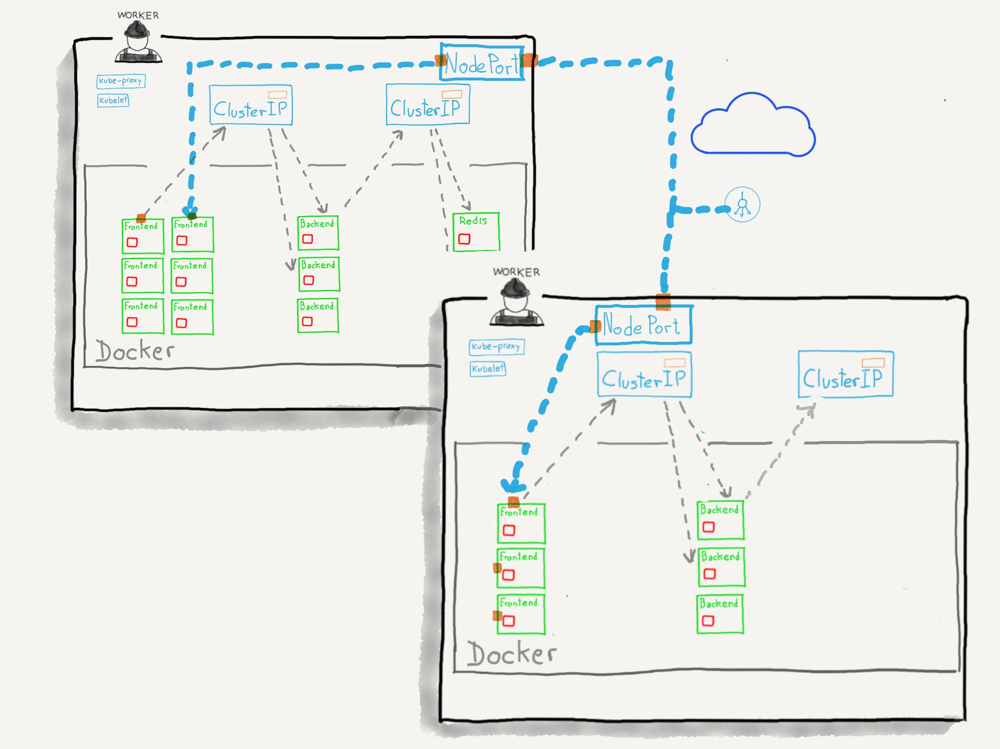
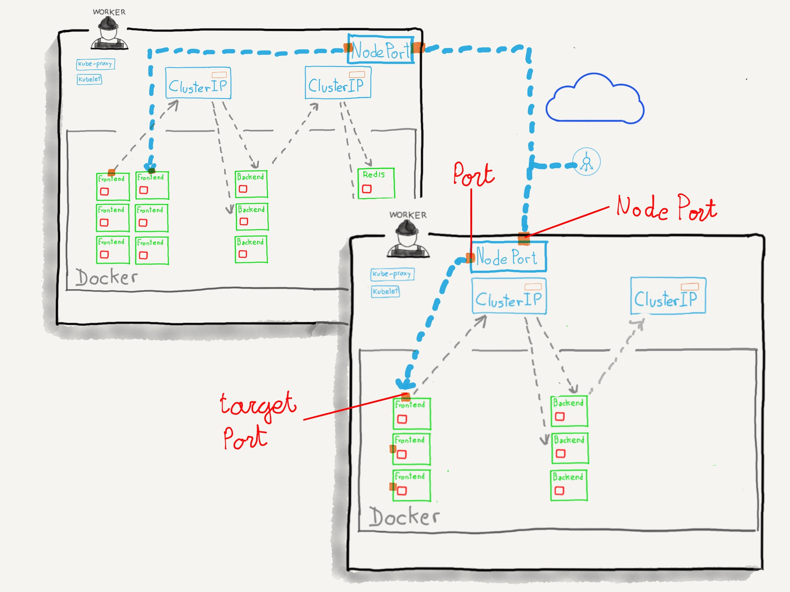

### `NodePort`

* Es una extensión del servicio `ClusterIP`
* A los dos puertos que utiliza el `ClusterIP` añade un tercer puerto (`nodePort`) 
  en cada uno de los nodos del cluster
* Este nodo es accesible desde el exterior usando `<nodeIP>:<nodePort>` 

^^^^^^

### `NodePort`

^^^^^^

### `NodePort`

notes:

Al igual que antes, esta imagen ilustra como funcionaría un servicio de tipo
`NodePort`. El tráfico llega al nodo a través del puerto `NodePort` y el servicio
lo enruta al puerto `targetPort` de los Pods.

**Si ese nodo del cluster no dispone en ese momento de ningún Pod que pueda recibir
el tráfico, el servicio lo enruta a través de la red interna al nodo adecuado**

^^^^^^

### `NodePort`

* El valor de `nodePort` está en el rango 30000–32767
* Por defecto Kubernetes nos asigna un valor en este rango
* Es posible asignar un valor fijo (dentro de ese rango). En ese caso,
  deberemos asegurarnos de que no haya colisiones con otros servicios que
  puedan estar en el mismo puerto

notes:

El valor del rango por defecto es un parámetro de configuración del cluster. Si 
tenemos control sobre el cluster podríamos modificarlo.

^^^^^^

### `NodePort`

Casos de uso

* Añadir conectividad externa a nuestro servicio
* Queremos / necesitamos configurar nuestro propio balanceador de carga