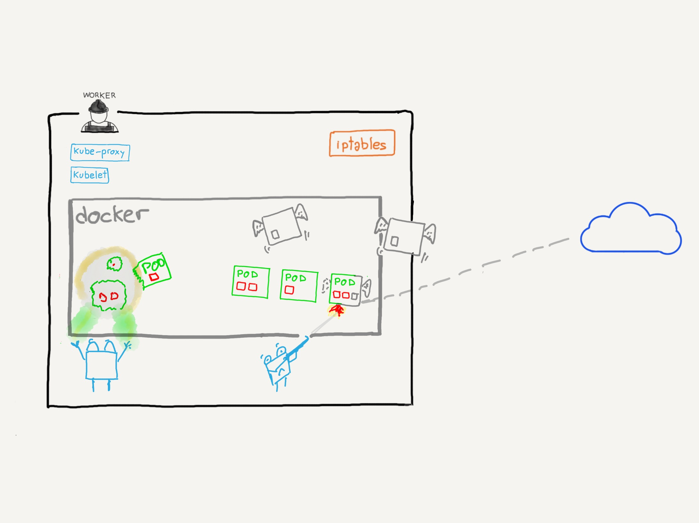
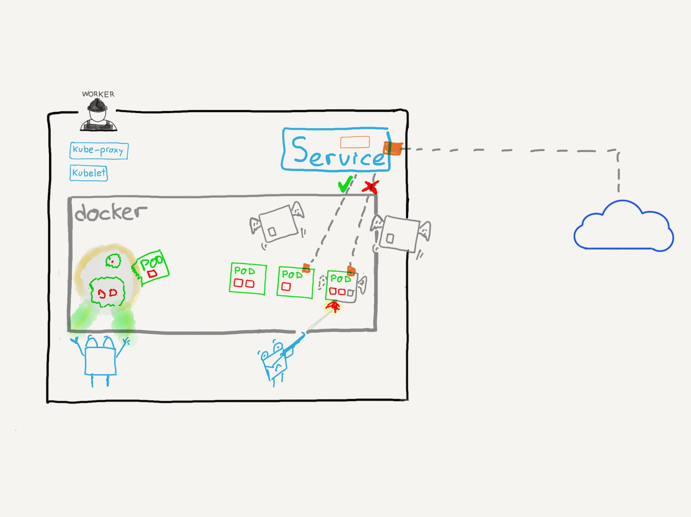

### ¿Que es un servicio?

Los servicios son los responsables de exponer una interfaz para acceder a los pods.

Permiten acceder a los Pods a través de la red tanto dentro como fuera del cluster.

^^^^^^

Los Pods son efímeros

Son dinámicos

`Deployments` y `ReplicaSets` se encargan de crearlos y destruirlos cuando se
necesite

^^^^^^

⛔ No es buena idea conectarse 

directamente a un Pod  

notes:

No es buena idea conectarse directamente a un Pod. Los pods están controlados
por capa de control de Kubernetes. `Deployments`, `Replication Controllers`,
`ReplicaSets` con ejemplos de objetos que en cualquier momento pueden decidir 
que el Pod al que te estás conectando tiene que desaparecer o ser sustituido por
otro... y si estás conectado a ese pod, pierdes la conexión con tu aplicación.

^^^^^^

notes:

Si nos conectamos a través del servicio, este sabe qué Pods se han encolado para
ser borrados y es capaz de detener el tráfico hacia ellos y enrutarlo bien hacia
nuevos Pods o Pods ya existentes.

^^^^^^

Un servicio es una **abstracción** en Kubernetes que define un conjunto de pods
y una política para poder acceder a ellos.