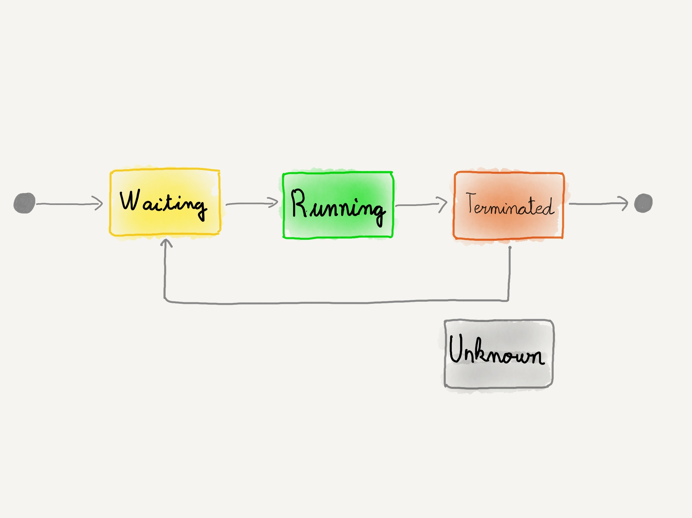

### Estado de los contenedores

Nos indican el estado en el que se encuentran los contenedores del `Pod`

El objeto `ContainerStatus` es un array de objetos, uno por contenedor. 

Nos da diferente información sobre los 
contenedores, como su nombre, su ID, la imagen que está ejecutando...

notes:

En la definición de [`PodState`](https://kubernetes.io/docs/reference/kubernetes-api/workload-resources/pod-v1/#PodStatus)
vemos que `containerStatuses` es un array de objetos `ContainerStatus`.

^^^^^^

### Estado de los contenedores

El campo que nos interesa en esta sección es `containerStatuses.state`

notes:

Dentro de la definición del objeto, `containerStatuses.state` es un objeto de tipo
`ContainerStateRunning` o `ContainerStateTerminated` o `ContainerStateWaiting`.

Sólo uno de los tres puede estar definido. El estado por defecto, si no se ha definido
ninguno será `ContainerStateWaiting`.

No voy a ir uno por uno revisando todas las propiedades de estos objetos. Solo
decir que contienen información detallada como el códido de retorno de un contenedor
y descripción del motivo cuando este termina, por ejemplo.

Otro campo relevante es `containerStatuses.lastState` que contiene información 
acerca de la última vez que el contenedore terminó

^^^^^^

### Estado de los contenedores

| Estado | Descripción  |
| ------------------------- | - |
| `Waiting` | En espera de que el contenedor comience a ejecutarse |
| `Running` | Existe al menos un proceso en ejecución dentro del contenedor |
| `Terminated` | El proceso principal del contenedor ha dejado de ejecutarse |
| `Unknown` | El estado del contenedor no se puede determinar |

notes:

Cuando el contenedor está en espera (`Waiting`), los campos `containerStatuses.state.waiting.message`
y `containerStatuses.state.waiting.reason` nos dan información del motivo por el que
el contenedor está en espera. Por ejemplo, porque la imagen se está descargando.

Cuando el contenedor ha terminado (`Terminated`) los campos 
`containerStatuses.state.terminated.message`, `containerStatuses.state.terminated.exitCode` y
`containerStatuses.state.terminated.reason` nos pueden ayudar a depurar el motivo por el que 
un contenedor ha terminado.

^^^^^^
### Estado de los contenedores

¿Cuando un contenedor está listo (_ready_)?

Cuando su comprobación de estado `readinessProbe` tiene éxito

notes:

Dentro de la definición del estado de un contenedor 
(ver la definición [aquí](), 
está la propiedad 
`containerStatuses.ready` que será verdadera cuando esta comprobación de estado
tenga éxito.