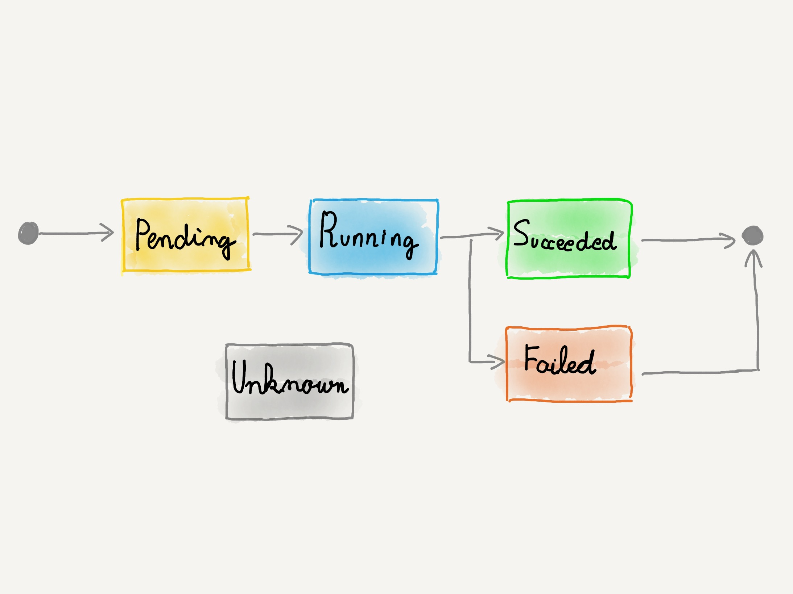

### Estado del `Pod`

Tras solicitar que se cree un `Pod`, podemos ver en qué estado se encuentra
solicitando el objeto al _API server_:

```
> kubectl describe pod <NAME>
```
* Dirección IP
* Cuando se inició el `Pod`
* La fase en la que se encuentra
* Los estados (_conditions_) por los que ha pasado ese `Pod`
* El estado de sus contenedores


notes:

En [este enlace](https://kubernetes.io/docs/reference/kubernetes-api/workload-resources/pod-v1/#PodStatus)
podemos ver la definición completa de qué información de estado nos facilita 
Kubernetes sobre un `Pod`

^^^^^^

### Fase



notes:

Estas son las cinco fases en las que puede encontrase un Pod: `Pending`, `Running`,
`Succeeded`, `Failed` y `Unknown`.

^^^^^^

### Fase: `Pending`

Cuando se solicita la creación del `Pod`, este queda en esta fase. Mientras se asigna
un nodo, se descargan las imágenes de los contenedores y estos se inician, el `Pod`
permanece como `Pending`.

^^^^^^

### Fase: `Running`

Al menos, uno de los contenedores del `Pod` se está ejecutando.

^^^^^^

### Fase: `Succeeded`

Todos los contenedores del `Pod` terminan su ejecución de forma correcta.

Una vez finalizados, los contenedores no se reiniciarán.

notes:

Esta fase solo llega a alcanzarse en aquellos `Pods` en los que los contenedores
no se ejecuten perpetuamente. Si configuramos un `Pod` con al menos un contenedor
configurado para que se reinicie siempre, esta fase nunca se alcanzará.

^^^^^^

### Fase: `Failed`

Todos los contenedores se han finalizado y al menos uno ha terminado con un error.

notes:

Terminar con un error es lo mismo que terminar el proceso y devolver un valor distinto de cero.

Si un nodo se desconecta del cluster o muere, Kubernetes aplica la política de marcar 
todos los `Pods` de ese cluster como `Failed`

^^^^^^

### Fase: `Unknown`

No se pudo obtener el estado del `Pod`

notes:

El motivo típico por el que un `Pod` acaba en esta fase es por un error de comunicación
con el nodo del cluster en el que el `Pod` se debería estar ejecutando. 

