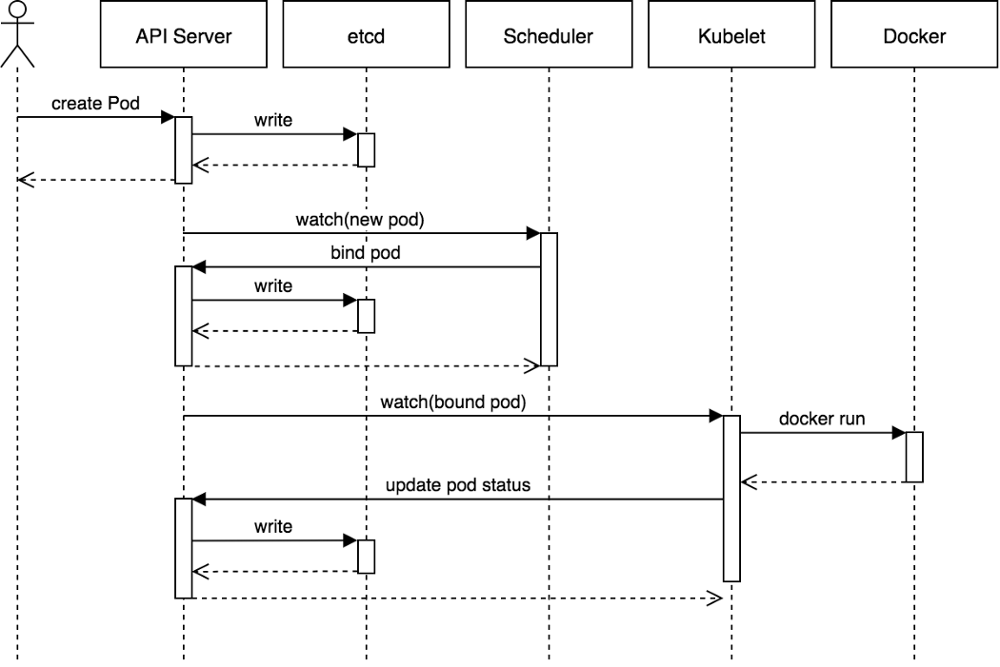

### Programación de un `Pod`

[Fuente: Artículo de Joe Beda](https://blog.heptio.com/core-kubernetes-jazz-improv-over-orchestration-a7903ea92ca)

Note:

Este diagrama de Joe Beda describe de forma muy concisa y clara lo que ocurre en Kubernetes
desde que solicitamos que se cree un `Pod` hasta que este se crea.

En este diagrama vemos cómo las componentes del _control plane_ de Kubernetes
que vimos en secciones anteriores trabajan juntas para crear un `Pod`.

El flujo básico sería el siguiente:

* El usuario solicita la creación de un `Pod` a través del  _API server_. Este 
  escribe en `etcd` la petición y el `Pod` queda pendiente de asignarse a un nodo 
  (_unbound_)
* El _scheduler_ se percata de que hay un `Pod` no asignado y lo asigna a un nodo. 
  Actualiza el _API server_ con la información de a qué nodo ha quedado asignado el `Pod`
* La componente `kubelet` del nodo en cuestión, detecta que hay un cambio en los `Pods` 
  asignados a ese nodo. Se conecta al _container runtime_ y levanta el o los contenedores.
  Una vez hecho, actualiza el estado en el `API server`
* `kubelet` monitoriza el estado del `Pod` a traves del _container runtime_. A medidas 
  que el estado de los contenedores y de los `Pods` cambian, `kubelet` actualiza 
  la información en el `API server`
