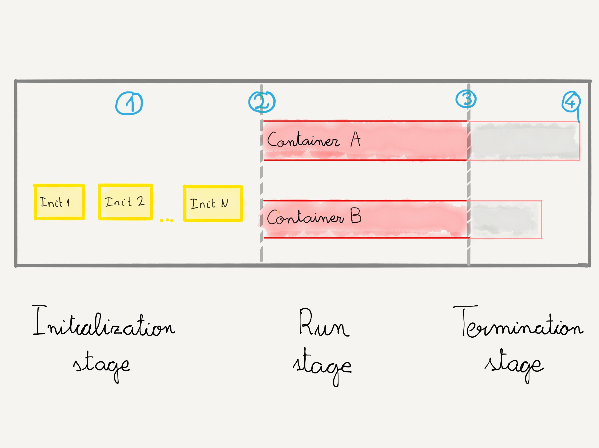
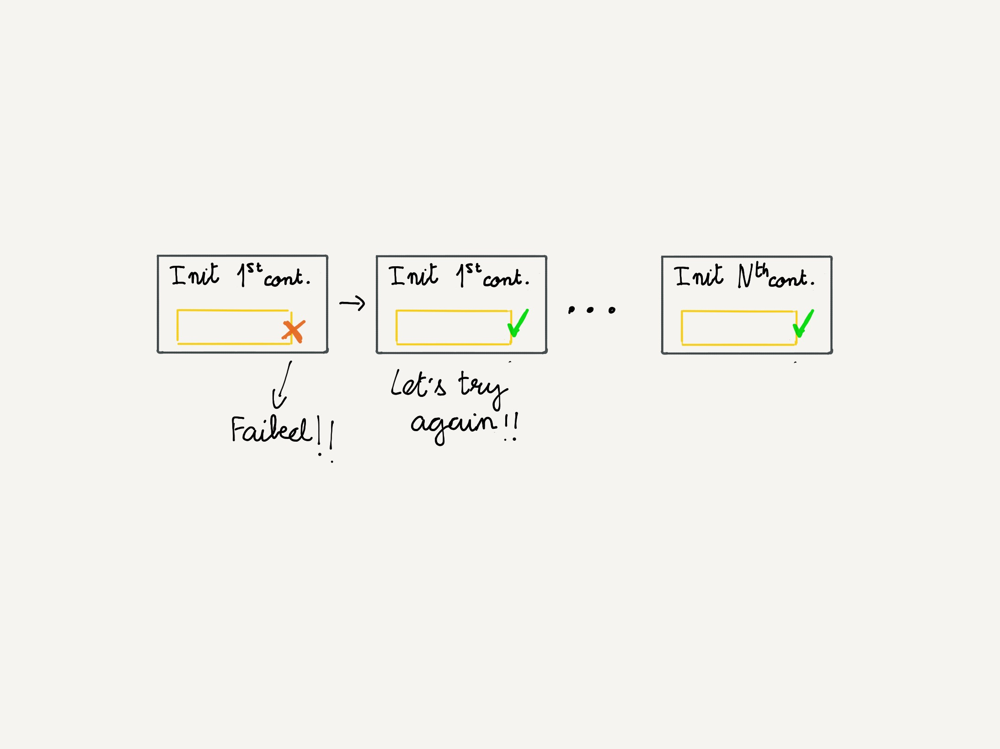
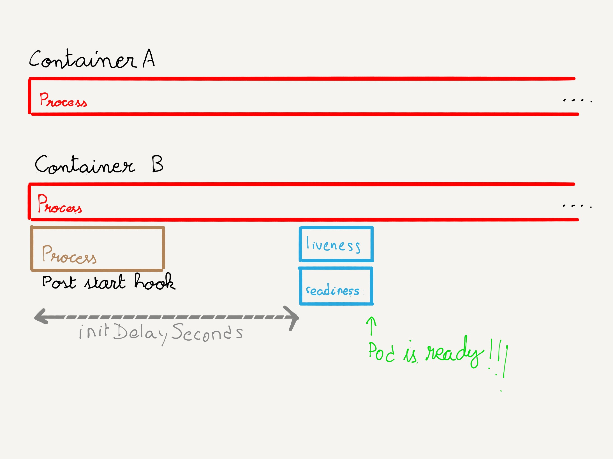
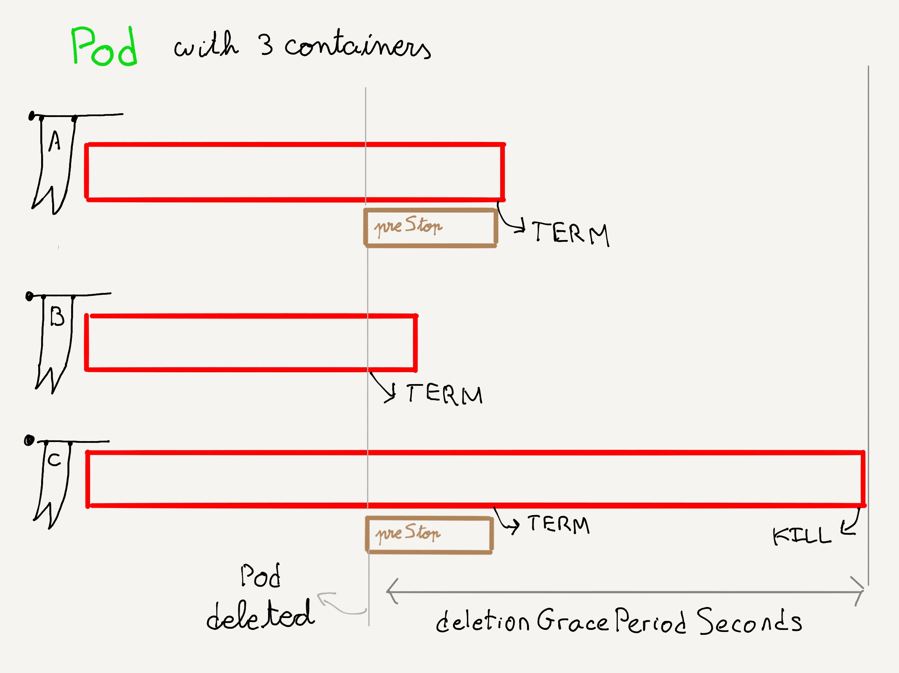

### Ciclo de vida del `Pod`

notes:

1 - Fase de incialización: durante esta fase se ejecutan los contenedores de inicialización. Se ejecutan en el orden en el que se han definido en el campo 
[`initContainers`](https://kubernetes.io/docs/reference/kubernetes-api/workload-resources/pod-v1/#containers). Este campo consiste en un array de 
[objetos `Container`](https://kubernetes.io/docs/reference/kubernetes-api/workload-resources/pod-v1/#Container).

2 - Cuando todos los contenedores de inicialización han terminado correctamente,
se inicia la segunda fase, en la que se ejecutan los contenedores del `Pod`. Esta 
fase durará hasta que los contenedores terminen de ejecutarse, lo que puede ocurir en unos
segundos o nunca.

3 - La fase de ejecución termina cuando, por cualquier motivo, el `Pod` debe finalizar su ejecución. Por ejemplo, necesitamos vaciar un nodo para poder realizar sobre él tareas de
mantenimiento. Es en este momento cuando termina la fase de ejecución y comienza la de 
finalización

4 - El `Pod` detiene los contenedores. Cuando todos ellos terminan, se puede considerar
que el `Pod` está listo para ser eliminado.

------

### Inicialización

_Conditions_ al inicio:

| `condition.type`  |         |
| ----------------- | ------- |
| `PodScheduled`    | `True`  |
| `Initialized`     | `False` |
| `ContainersReady` | `False` |
| `Ready`           | `False` |  

notes:

Durante la fase inicialización, estos son los estados (_conditions_) que tendrá nuestro
pod.

^^^^^^

notes:

El flujo sería es siguiente:

* Nos descargamos la imagen del primer contenedor de inicialización
* Si el contenedor se ejecuta correctamente se para al siguiente contenedor y se repite el proceso
* Si el contenedor falla, se mira cuál es la política de reinicio del `Pod`
  * Si la política es `Always` o `OnFailure`, se vuelve a lanzar el contenedor
  * Si la política es `Never`, se detiene la inicialización (los sigientes contenedores
    no se ejecutarán) y el `Pod` mostrará el estado `Init: Error`

^^^^^^

_Conditions_ al final:

| `condition.type`  |         |
| ----------------- | ------- |
| `PodScheduled`    | `True`  |
| `Initialized`     | `True`  |
| `ContainersReady` | `False` |
| `Ready`           | `False` |  

------

### Ejecución

_Conditions_ al inicio:

| `condition.type`  |         |
| ----------------- | ------- |
| `PodScheduled`    | `True`  |
| `Initialized`     | `True`  |
| `ContainersReady` | `False` |
| `Ready`           | `False` |  

^^^^^^

notes:

Una vez todos los contenedores de inicialización se han ejecutado correctamente,
se ejecutan los contenedores del `Pod`.

`kubelet` ejecuta los contenedores en el orden en el que se han definido en
la definición del `Pod`.

Si un contenedor define un `postStartHook`, a la vez que se inicia la ejecución del proceso
principal del contenedor, se ejecuta un segundo proceso con el _hook_ que hemos definido. El 
siguiente contenedor, si lo hubiesemos definido, no se ejecuta
hasta que este proceso se haya terminado.

Mientras que la creación de los contenedores es un proceso secuencial,cuando se termina un `Pod` 
la finalización de los contenedores se hace en paralelo.

Una vez superado el tiempo `initDelaySeconds` se ejecutan las comprobaciones de estado 
(que veremos en el siguiente capítulo). Si la comprobación de estado `readinessProbe`
es correcta, el `Pod` está listo para recibir peticiones.

^^^^^^

### Ejecución

_Conditions_ al final:

| `condition.type`  |         |
| ----------------- | ------- |
| `PodScheduled`    | `True`  |
| `Initialized`     | `True`  |
| `ContainersReady` | `True`  |
| `Ready`           | `True`  |  

------

### Finalización

Los contenedores continúan su ejecución hasta que el `Pod` se elimina.

_Conditions_ al inicio:

| `condition.type`  |         |
| ----------------- | ------- |
| `PodScheduled`    | `True`  |
| `Initialized`     | `True`  |
| `ContainersReady` | `True`  |
| `Ready`           | `True`  |  

notes:

El `Pod` podemos eliminarlo nosotros o puede eliminarlo Kubernetes por varios
motivos:
* Como consecuencia del auto escalado de la aplicación, un descenso del tráfico
  puede hacer que algunos `Pods` se puedan eliminar
* Necesitamos _drenar_ un nodo del cluster para realizar tareas de mantenimiento.
  Kubernetes eliminará todos los `Pods` de ese nodo y los creará en otros nodos
  del cluster

^^^^^^

### Finalización

notes:

Cuando llega el momento de destruir el `Pod`, `kubelet` comienza a detener
los contenedores. El primer paso es ejecutar el `preStopHook` de todos ellos 
y comenzar a contar el tiempo definid en `terminationGracePeriodSeconds`
#### Contenedor A

Este contenedor tiene un `preStopHook`. Se ejecuta el proceso y cuando termina,
el proceso principal del contenedor recibe la señal `TERM`. Este contenedor
termina correctamente antes de que pasen `terminationGracePeriodSeconds`.

#### Contenedor B

Este contenedor no tiene definido un `preStopHook`, por lo que el proceso principal
recibe directamente la señal `TERM`. Este contenedor
también termina correctamente antes de que pasen `terminationGracePeriodSeconds`.

###### Contenedor C

Este contenedor tiene un `preStopHook`. Se ejecuta el proceso y cuando termina,
el proceso principal del contenedor recibe la señal `TERM`. Sin embargo, el proceso 
principal no es capaz de finalizar correctamente antes de que pasen 
`terminationGracePeriodSeconds` segundos por lo que `kubelet` le envía la señal
`KILL` para terminar el proceso y eliminar el `Pod`.

^^^^^^

✅ Asegurate de que tus contenedores procesan y responden adecuadamente a la
señal `TERM`

notes:

Es importante que esto sea así para que el proceso se finalización de nuestros
`Pods` se limpio