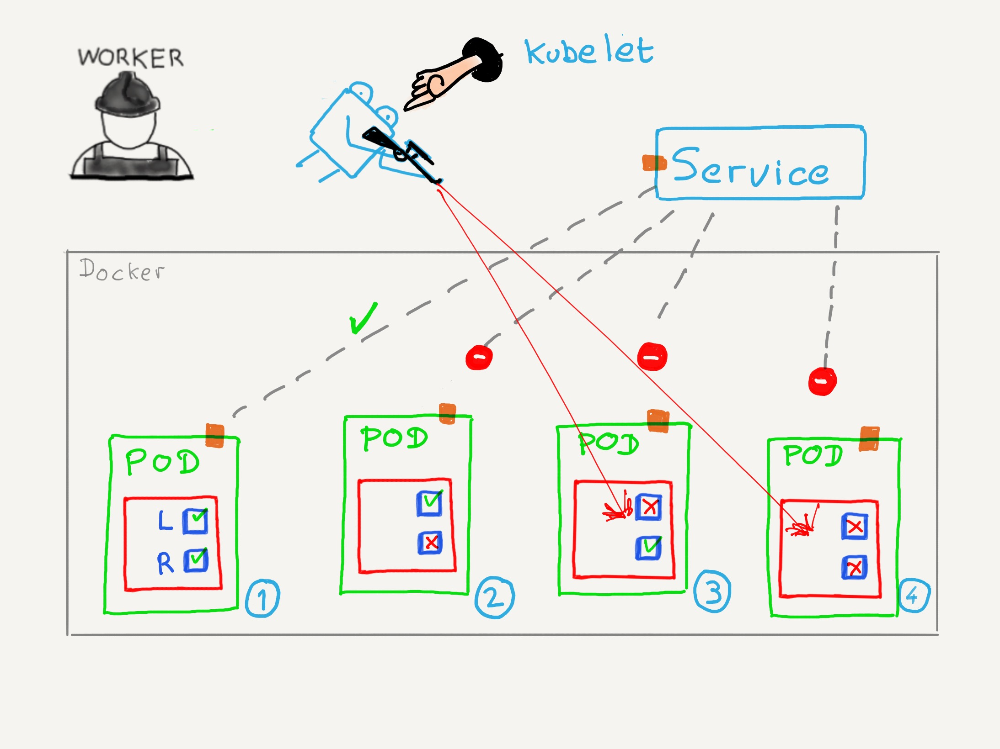

### Uso de las sondas

* _readiness_: un contenedor está preparado para recibir tráfico
* _liveness_: un contenedor se está ejecutando
* _startup_: un contenedor está correctamente inicializado

^^^^^^

### Parámetros

* `initialDelaySeconds`: Tiempo que transcurre entre que se levanta el contenedor
  y el primer _liveness probe_ se ejecuta
* `terminationGracePeriodSeconds` (beta): Tiempo que le damos a un contenedor para que
  termine correctamente
* `periodSeconds`: frecuencia de muestreo
* `timeoutSeconds`: tiempo de expiración de la sonda
* `failureThreshold`: número de reintentos antes de fallo
* `successThreshold`: número de intentos para éxito después de un fallo
Note:

* `initialDelaySeconds`: tiempo que le damos al contenedor para que se levante 
  antes de comprobar su estado de forma regular
* `terminationGracePeriodSeconds`: cuando pedimos a un proceso que termine (por ejemplo
  cuando paramos un Pod) el sistema intenta en primer lugar hacer una parada controlada
  del proceso. Si este no responde y no se detiene en el tiempo indicado en este
  parámetro, se procede a matarlo con una señal _kill_

  Posibles valores:
  * `0`: se hace un kill directamente
  * `nil`: se utilizará el valor del campo  `terminationGracePeriodSeconds ` definido
    para el pod.

  Este campo está a día de hoy en beta y es necesario activarlo para poder usarlo.

* `periodSeconds`: tiene un valor por defecto de 10 segundos
* `timeoutSeconds`: 1 segundo por defecto
* `failureThreshold`: 3 intentos por defecto
* `successThreshold`: 1 intento

^^^^^^

### `Pods` y sondas

Para que un Pod pueda recibir tráfico, todas las comprobaciones _readiness_ de 
todos sus contenedores tiene que ser correctas.

^^^^^^

### _startup_

Se ejecuta durante el proceso de inicialización del `Pod`

Verifica si el contenedor se ha iniciado correctamente

Si se especifica, no se ejecutará ninguna otra comprobación hasta que esta tenga
éxito.

En caso de fallo, el contenedor se reiniciará.

Note:

El caso de uso principal de este tipo de sondas es en contenedores que requieren
un tiempo largo de inicialización.

Imagina que para que una aplicación, o una parte de ella, se pueda ejecutar 
es necesario que se rellene una _cache_ con datos. Cuando la cache está vacía,
este proceso puede durar varios minutos en los que el contenedor no termina de inicalizarse
hasta que la cache se ha terminado de rellenar. Es aquí donde podemos utilizar
esta sonda para comprobar que el proceso se ha llevado correctamente antes de 
considerar que el `Pod` está listo para recibir tráfico.

^^^^^^

### _readiness_

Sondas utilizadas para saber cuándo un contenedor puede recibir tráfico

Se ejecutan, por ejemplo, dentro del ciclo de vida del Pod después de que los contenedores se han inicializado

En caso de fallo, el contenedor dejará de recibir tráfico

Note:

Para dejar de recibir tráfico, el `endpoints controller` saca la IP del `Pod`
de todos los servicios que sean un _match_ de ese `Pod` 
(¿recuerdas los selectores?).

^^^^^^

### _liveness_

Sondas utilizadas para saber si un contenedor se está ejecutando

En caso de fallo, `kubelet` matará el contenedor

Note:

^^^^^^

### _liveness_ vs _readiness_ 

Note:

* Caso 1: Ambas comprobaciones son positivas. El `Pod` Recibe tráfico y funciona
  con normalidad
* Caso 2: el contenedor está activo y funcionando, pero la comprobación _readiness_ falla.
  Por ejemplo: tenemos el contenedor en mantenimiento. O se trata de un contenedor que
  no puede aceptar más peticiones hasta que esta termina. En este caso, el contenedor sigue activo
  y el servicio deja de enviarle tráfico
* Casos 3 y 4: en cuanto la comprobación _liveness_ falla, `kubelet` procederá a
  a reiniciar los contenedores. ¡Los `Pods` no se modifican!

El caso 3 es difícil que se de ya que si el contenedor no se está ejecutando, es complicado
que la comprobación _readiness_ responda con éxito. Aún así, se podría dar esta situación
mientras Kubernetes está ejecutando las comprobaciones y procesándolas. En cualquier caso, en cuanto
falle la comprobación _liveness_, el contenedor dejará de recibir tráfico porque el `Pod` cambiará
de estado mientras el contenedor se reinicia.

^^^^^^

### ¿Múltiples contenedores?

Si los `Pods` tienen múltiples contenedores:
* Un fallo en _liveness_ reinicia el contenedor, no todo el `Pod`
* un fallo en _readiness_ hace que todo el `Pod` deje de recibir tráfico

^^^^^^

✅ En producción, todos los contenedores de los `Pods` deberían llevar comprobaciones
de estado