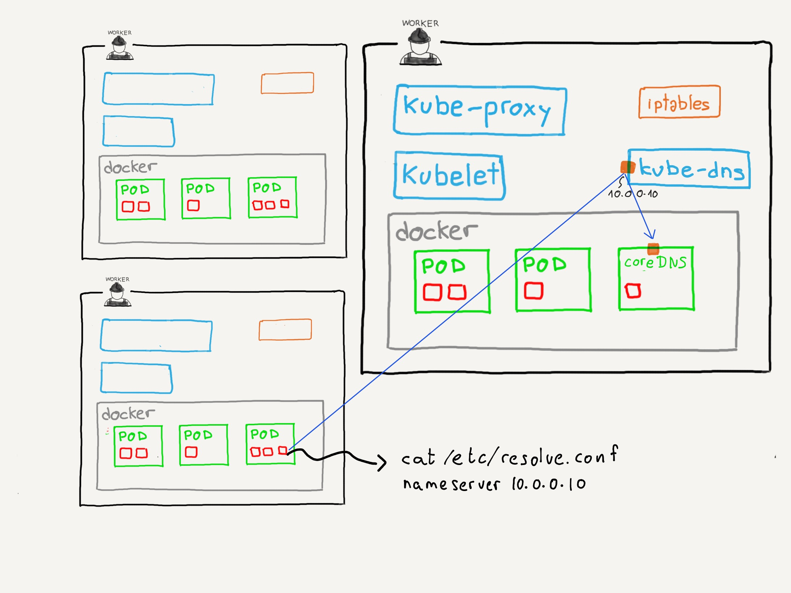

Note:


_add on_ que se instala en el cluster.

Crea un `Pod` y un `Service` con un servidor DNS y configura `kubelet` para que, 
a su vez configure, los contenedores para usar este servidor DNS. Lo hace inyectando
en los contenedores una configuración predeterminada en el fichero 
`/etc/resolv.conf`

Los `Pods` relacionados con el servicio `kube-dns` implentan el DNS utilizando 
[coreDNS](https://coredns.io/) que es una aplicación escrita en el lenguaje de programación Go.

Cuando `kubelet` gestiona los `Pods`, añade y elimina registros de este 
servidor DNS

^^^^^^

```text [1,4]
$ kubectl get services -o wide --all-namespaces
NAMESPACE     NAME         TYPE        CLUSTER-IP   EXTERNAL-IP   PORT(S)                  AGE    SELECTOR
default       kubernetes   ClusterIP   10.96.0.1    <none>        443/TCP                  108s   <none>
kube-system   kube-dns     ClusterIP   10.96.0.10   <none>        53/UDP,53/TCP,9153/TCP   107s   k8s-app=kube-dns
```

Note:

Veamoslo en acción. Si mostramos todos los servicios de nuestro cluster, veremos el
servicio `kube-dns`


^^^^^^

```text [1,3]
$ kubectl get pods -o wide --all-namespaces    
NAMESPACE     NAME                               READY   STATUS    RESTARTS   AGE     IP              NODE       NOMINATED NODE   READINESS GATES
kube-system   coredns-78fcd69978-sthkl           1/1     Running   0          4m57s   172.17.0.2      minikube   <none>           <none>
kube-system   etcd-minikube                      1/1     Running   0          5m10s   192.168.1.155   minikube   <none>           <none>
kube-system   kube-apiserver-minikube            1/1     Running   0          5m12s   192.168.1.155   minikube   <none>           <none>
kube-system   kube-controller-manager-minikube   1/1     Running   0          5m10s   192.168.1.155   minikube   <none>           <none>
kube-system   kube-proxy-cqd94                   1/1     Running   0          4m58s   192.168.1.155   minikube   <none>           <none>
kube-system   kube-scheduler-minikube            1/1     Running   0          5m10s   192.168.1.155   minikube   <none>           <none>
kube-system   storage-provisioner                1/1     Running   0          5m7s    192.168.1.155   minikube   <none>           <none>
```

Note:

Si mostramos todos los `Pods` de nuestro cluster, veremos el pod correspondiente a `coreDNS`.


^^^^^^

Cuando creamos un `Pod`, `kubelet` se encarga de añadir el siguiente fichero `/etc/resolv.conf`
a todos los contenedores de nuestros `Pods`:

```shell
nameserver 10.96.0.10
search default.svc.cluster.local svc.cluster.local cluster.local
options ndots:5
```

Note:

La dirección IP del servidor de nombres corresponderá con la dirección IP del servicio
`kube-dns`.

Este fichero permite que la resolución de nombres dentro de cualquier contenedor pase por el servicio
`kube-dns` de nuestro cluster.

Cuando añadimos o quitamos servicios, se añaden o se borran registros de `coreDNS` según corredponda
de forma que podemos localizarlos utilizando sus nombres.

[Página de manual de `resolv.conf`](https://www.man7.org/linux/man-pages/man5/resolv.conf.5.html)

^^^^^^

¿Para qué objetos se crean registros DNS?
* `Services`
* `Pods`

^^^^^^ 

### Registros DNS para `Services`

* A/AAAA en función de la familia de direcciones IP utilizada
* SRV

^^^^^^

### Registros DNS para `Services`: A / AAAA

`<nombre>.<namespace>.svc.<cluster-name>`

(`foo-website.defuault.svc.cluster.local`)

Note:

El nombre se extrae de `metadata.name`.

Esta entrada DNS apunta a la dirección IP del servicio, que será el encargado de hacer
el balanceo de carga.

Un caso especial son los 
[`HeadlessServices`](https://kubernetes.io/docs/concepts/services-networking/service/#headless-services)
Es un tipo muy específico de servicio que se utiliza para interactuar con otros
sistemas de _service discovery_, es decir, si no queremos utilizar la implementación de Kubernetes.

Para este tipo de servicios _headless_, el DNS devuelve el conjunto de direcciones IP de los `Pods`
seleccionador por el servicio. Es el cliente el que decide como trabajar con ese conjunto. Por ejemplo,
una vez tenemos las direcciones, podríamos hacer una llamada a cada una de ellas para saber cuál de
esos `Pods` tiene más espacio disponible. Una vez lo sepamos, nuestra aplicación almacena ficheros en ese `Pod`
para optimizar el espacio. De esta forma, podemos saltarnos la implementación de Kubernetes y utilizar nuestro 
propio sistema para saber a qué `Pod` conectarnos.

^^^^^^

### Registros DNS para `Services`: SRV

Se crean estos registros para:
* puertos con nombre (definidos dentro del `Service`)
* `Headless Services`

`<nombre-puerto>.<protocolo>.<nombre-servicio>.svc.<cluster-name>`


Note:

Como ocurría con los registros A/AAAA en los _Headless services_, aquí también se devuleve una 
tupla de valores, uno para cada uno de los `Pods`.

Recordatorio: [¿Que es un registro SRV?](https://www.cloudflare.com/learning/dns/dns-records/dns-srv-record/)

^^^^^^
### Registros DNS para `Pods`: A / AAAA

Si se crea directamente:

`<ip>.<namespace>.pod.<cluster-name>`

(`172-0-0-10.default.pod.cluster.local`)

<hr/>

Si se crea a través de un `Deployment` o `DaemonSet`:

`<ip>.<nombre-deployment>.<namespace>.pod.<cluster-name>`

(`172-0-0-10.foo-website.default.pod.cluster.local`)

^^^^^^

### `subdomain` / `hostname` del Pod

Cuando creamos un `Pod` tenemos cierto control sobre el registro A/AAA que se crea.

Dentro de la 
[especificación del `Pod`](https://kubernetes.io/docs/reference/kubernetes-api/workload-resources/pod-v1/#hostname-and-name-resolution) 
podemos definir dos campos:

* `hostname`
* `subdomain`

`<hostname>.<subdomain>.<namespace>.svc.<cluster-domain>`

Note:

* `hostname`: si se especifica, se utiliza este valor en lugar de `metadata.name`
* `subdomain`: si se especifica, el registro A/AAAA que se crea será

  `<hostname>.<subdomain>.<namespace>.svc.<cluster-domain>`

^^^^^^
### `subdomain` / `hostname` del Pod

No funcionan cuando el `Pod` se crea desde un Deployment. 

Note:

Si miramos la definición de 
[`PodTemplateSpec`](https://kubernetes.io/docs/reference/kubernetes-api/workload-resources/pod-template-v1/#PodTemplateSpec),
que es lo que realmente definimos en un `Deployment`, vemos que estos dos campos no están definidos.

^^^^^^

### `hostAliases`

Forma de añadir nuestras propias entradas al fichero `/etc/hosts`

```yaml [7-15]
apiVersion: v1
kind: Pod
metadata:
  name: pod-con-hostaliases
spec:
  restartPolicy: Never
  hostAliases:
  - ip: "127.0.0.1"
    hostnames:
    - "foo.local"
    - "bar.local"
  - ip: "10.1.2.3"
    hostnames:
    - "foo.remote"
    - "bar.remote"
  containers:
  - name: cat-hosts
    image: busybox
    command:
    - cat
    args:
    - "/etc/hosts"
```
Note:

* [Especificación del `Pod`](https://kubernetes.io/docs/reference/kubernetes-api/workload-resources/pod-v1/#hostname-and-name-resolution)
* [Ejemplos](https://kubernetes.io/docs/tasks/network/customize-hosts-file-for-pods/)