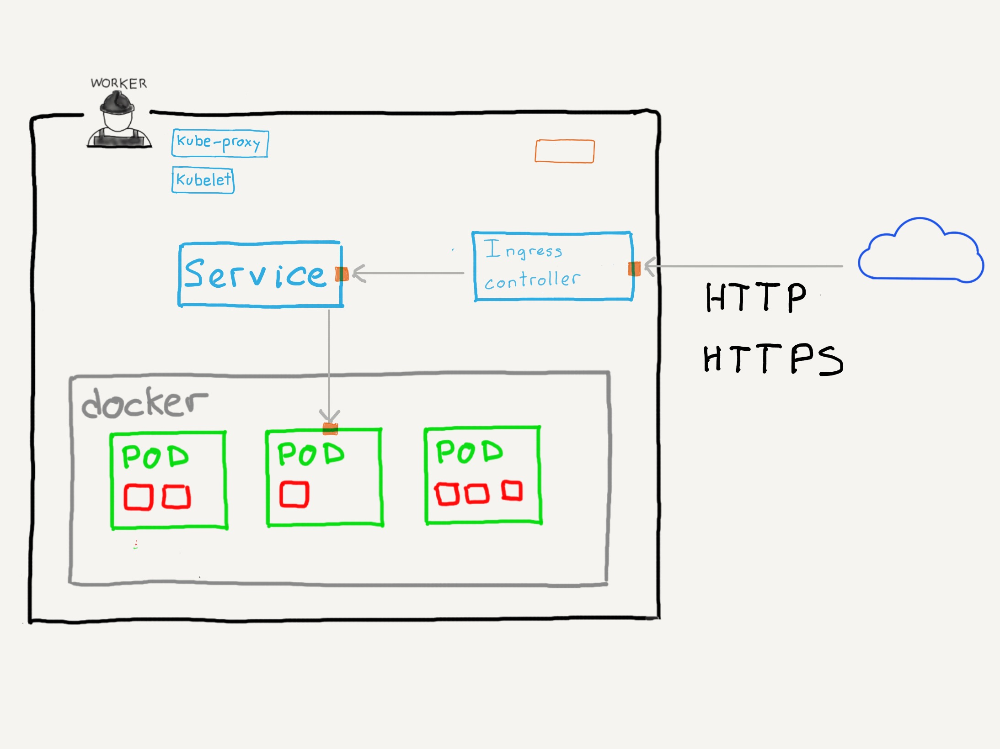

### `Ingress`

* Da a los `Services` dentro del cluster **rutas HTTP/HTTPS para acceder a ellos**.

Note:

Sólo funciona con rutas HTTP/HTTPS.  Si necesitamos hacer lo mismo con otros servicios, 
por ejemplo Redis, tendremos que usar `Services` de tipo `NodePort` o balanceadores 
de carga externos que permitan el balanceo TCP/UDP.

^^^^^^

### Motivación

`LoadBalancer`: sólo uno por servicio 

💸💸💸💸💸

Note:

Los balanceadores de carga que hemos visto en las secciones anteriores no permiten
el enrutamiento entre varios `Services`.

Es decir: 1 `Service` = 1 `Load Balancer`

El coste medio de un balanceador de carga está en torno a los 15-20$ al mes.
Si tienes una aplicación con 20 `Services` accesible desde el exterior, estamos hablando de 
400$ al mes (4800$ al año) sólo para poder enviar tráfico a tu cluster.

^^^^^^

### Casos de uso

* Balanceo de tráfico HTTP/HTTPS
* Terminación SSL/TLS
* _Named-Based virtual hosting_

^^^^^^

### Requisitos

_ingress controller_ + `Ingress`

([Ver controladores disponibles](https://kubernetes.io/docs/concepts/services-networking/ingress-controllers/))

Note:

El objeto `Ingress` es el que define las reglas que _reparten_ el tráfico. 
El _ingress controller_ es el que recibe el tráfico y las ejecuta.

Existen controladores para nginx, haproxy, Envoy, Traekik... En el enlace
de la diapositiva dispones de una lista a todos ellos.

