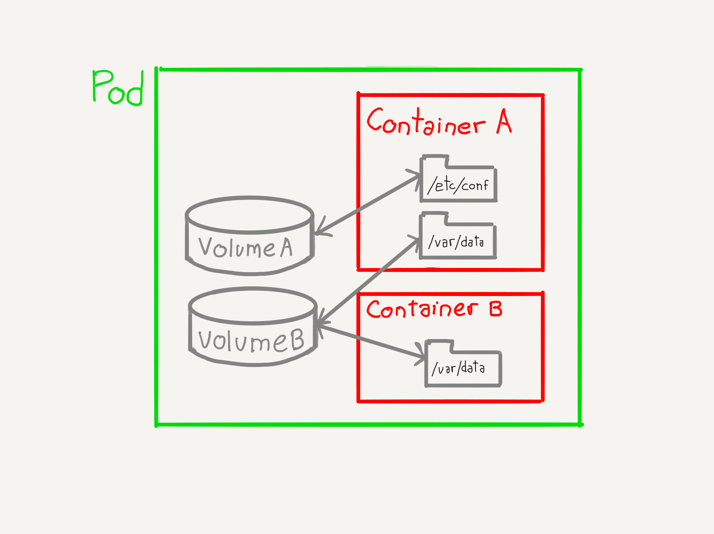

### Volúmenes

Los volúmenes de Kubernetes cubren un expectro muy amplio de casos de uso

En el curso veremos sólo algunos de los usos más habituales

[Más información: sección de almacenamiento de la documentación de Kubernetes](https://kubernetes.io/docs/concepts/storage/)

^^^^^^

### Volúmenes

Usos:

* Persistir estado
* Compartir información entre contenedores dentro de un `Pod`
* Compartir información entre diferentes `Pods`
* _Inyectar_ información a los `Pods` (`Secrets`, `ConfigMaps`)

notes:

Los `Pods` no persisten el estado de las aplicaciones. El uso de volúmenes es la manera que nos facilita
Kubernetes para guardar el estado.

^^^^^^

### Volúmenes

Los volúmenes, al igual que los contenedores, no son objetos de alto nivel dentro de la API de kubernetes

Los volúmenes se definen como una componente dentro de la especifiación de un `Pod`

notes:

Igual que no existe un comando de `kubectl` para mostrar los contenedores que hay en nuestro cluster,
tampoco existe un comando para listar los volúmenes.

^^^^^^

### Volúmenes: compartir información entre contenedores

notes:

Un `Pod` puede tener varios volúmenes y los contenedores de ese `Pod` pueden acceder a uno o varios
de esos volúmenes

^^^^^^

### Volúmenes: compartir información entre contenedores

notes: 

Los contenedores dentro de un `Pod` pueden montar un mismo volumen, en la misma o en diferentes carpetas,
para de esta manera, compartir información.

Si tenemos concurrencia en el acceso a disco, será nuestra responsibalidad, como desarrolladores de la aplicación,
gestionarla correctamente.

^^^^^^

### Volúmenes: compartir información entre `Pods`

notes:

Al igual que un varios contenedores de un `Pod` pueden compartir un volume, el uso de volúmenes permite
que varios `Pods` puedan compartir un mismo espacio de almacenamiento externo.

De nuevo, la gestión de la concurrencia de acceso a la información guardada en el volumen es responsabilidad de la aplicación.

^^^^^^

### Volúmenes

Persistencia entre reinicios de un `Pods`

notes:

Cuando un `Pod` se inicia, se montan los volúmenes en las correspondientes carpetas (definidas en la especificación)

Cuando el contenedor se reinicia, los volúmenes se vuelven a montar
