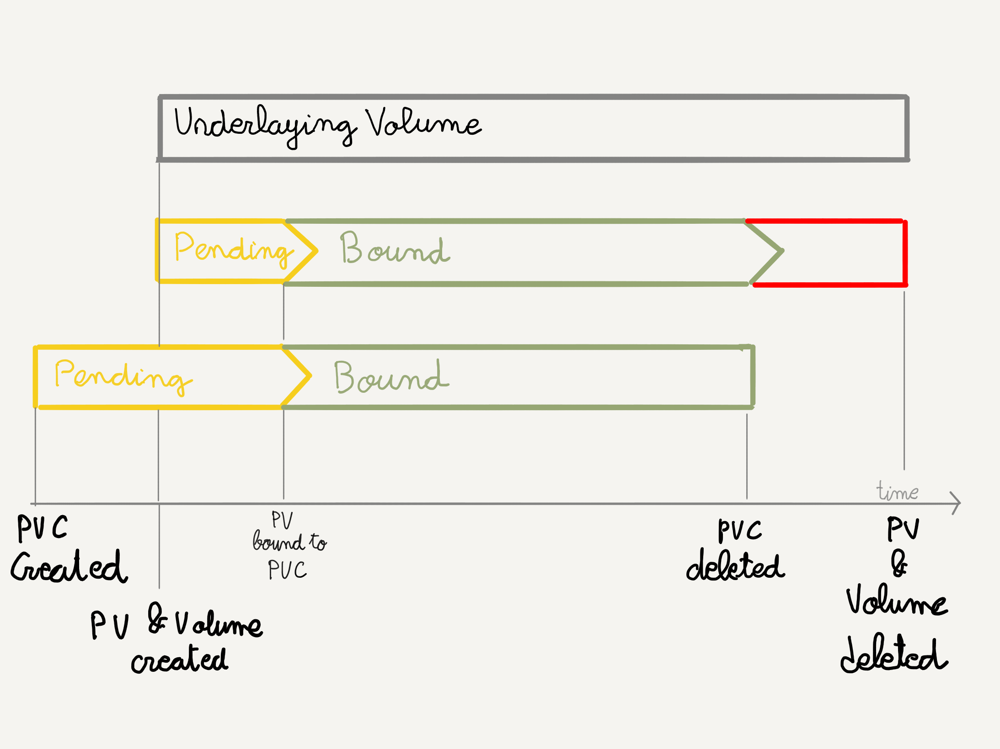

### Aprovisionamiento dinámico

En las secciones anteriores, hemos utilizado volúmenes que estaban previamente
configurados (a mano) por el administrador

¿Qué podemos hacer para evitar la configuración manual?

notes:

Los administradores del cluster necesitarían configurar decenas o cientos de volúmenes
para poder dar servicio a todas las aplicaciones que se alojan en un cluster.

Tienen que encargarse de borrar los volúmenes que ya se han utilizado y estar pedientes
de crear los volúmenes necesarios de cada tipo para que el cluster 
esté siempre en funcionamiento.

Esto va en contra de la filosofía de Kubernetes, que es precisamente la de automatizar
y facilitar la gestión de clusters a gran escala.

^^^^^^

### Aprovisionamiento dinámico

La solución es el aprovisionamiento dinámico (_Dynamic provisioning_)

**Crear el espacio de almacenamiento de forma dinámica según la demanda**


^^^^^^

### Aprovisionamiento dinámico

Las dos piezas que permiten este aprovisionamient dinámico son:

* `StorageClass`: Objeto de la API de kuernetes que permite a los administradores
  describir los tipos de almacenamiento persistente que existen en el cluster
* `Provisioner`: crea espacios de almacenamiento de una clase determinada

^^^^^^

### Aprovisionamiento dinámico: `StorageClass`

```shell
$ kubectl get sc
NAME                             PROVISIONER       RECLAIMPOLICY   VOLUMEBINDINGMODE      ALLOWVOLUMEEXPANSION   AGE
ionos-enterprise-hdd (default)   cloud.ionos.com   Delete          WaitForFirstConsumer   true                   65d
ionos-enterprise-ssd             cloud.ionos.com   Delete          WaitForFirstConsumer   true                   65d
```

notes:

En este ejemplo vemos la lista de `StorageClasses` que han definido los administradores del cluster
gestionado de IONOS.

^^^^^^

#### Aprovisionamiento dinámico: `StorageClass`

```shell
$ kubectl get sc ionos-enterprise-hdd  -o yaml     
```

```yaml [22]
allowVolumeExpansion: true
apiVersion: storage.k8s.io/v1
kind: StorageClass
metadata:
  annotations:
    meta.helm.sh/release-name: csi-ionoscloud
    meta.helm.sh/release-namespace: kube-system
    storageclass.kubernetes.io/is-default-class: "true"
  creationTimestamp: "2021-11-27T18:00:33Z"
  labels:
    app.kubernetes.io/instance: csi-ionoscloud
    app.kubernetes.io/managed-by: Helm
    app.kubernetes.io/name: csi-ionoscloud
    app.kubernetes.io/version: v1.4.0
    helm.sh/chart: csi-ionoscloud-1.4.1
  name: ionos-enterprise-hdd
  resourceVersion: "231451030"
  uid: 03a08131-2cd9-4b05-b048-6ea04a8257d1
parameters:
  fstype: ext4
  type: HDD
provisioner: cloud.ionos.com
reclaimPolicy: Delete
volumeBindingMode: WaitForFirstConsumer
```

^^^^^^

### Aprovisionamiento dinámico: `Provisioner`

En este cluster tenemos un único provisioner responsable de crear los dos tipos de almacenamiento disponibles

Podríamos tener `Provisioners` encargados de crear volúmenes NFS, por ejemplo

Un `Provisioner` puede ser responsable de gestionar diferentes `StorageClasses`

^^^^^^
### Aprovisionamiento dinámico: Uso

Paso 1: creamos un `PersistentVolumeClaim`

```yaml
apiVersion: v1
kind: PersistentVolumeClaim
metadata:
  name: default-storage-data
spec:
  resources:
    requests:
      storage: 1Gi
  accessModes:
  - ReadWriteOnce
```

^^^^^^

### Aprovisionamiento dinámico: Uso

Paso 2: Usamos el `PersistentVolumeClaim` en un `Pod`

```yaml [6-9]
apiVersion: v1
kind: Pod
metadata:
  label: test-data-pod
spec:
  volumes:
  - name: test-data
    persistentVolumeClaim:
      claimName: default-storage-data
  containers:
  - name: writer
    image: busybox
    command:
    - sh
    - -c
    - |
      echo "A writer pod wrote this." > /test-data-mountpoint/${HOSTNAME} &&
      echo "I can write to /test-data-mountpoint/${HOSTNAME}." ;
      sleep 9999
    volumeMounts:
    - name: test-data
      mountPath: /test-data-mountpoint
```

^^^^^^

### Aprovisionamiento dinámico: Ciclo de vida



notes:

A diferencia de los volúmenes aprovisionados manualmente, lo primero que se crea en este caso es
el `PersistentVolumeClaim`.

Cuando el objeto se crea, el `Provisioner` correspondiente (definido en el `StorageClass`) crea el volumen
y el objeto `PersistentVolume` y lo enlaza con el `PersistentVolumeClaim`. Una vez están ligados, los `Pods` pueden 
montar el volumen y acceder a la información.

Cuando el `PersistentVolumeClaim` se borra, se borran también el volumen y el objeto `PersistentVolume`

^^^^^^

### Aprovisionamiento dinámico: _Volume binding modes_

* `Inmediate`: el volumen se aprovisiona y se enlaza cuando se crea el `PersistenVolumeClaim`
* `WaitForFirstConsumer`: el volumen se aprovisiona y se enlaza cuando se crea el primer `Pod` que 
  utiliza el `PersistentVolumeClaim`


