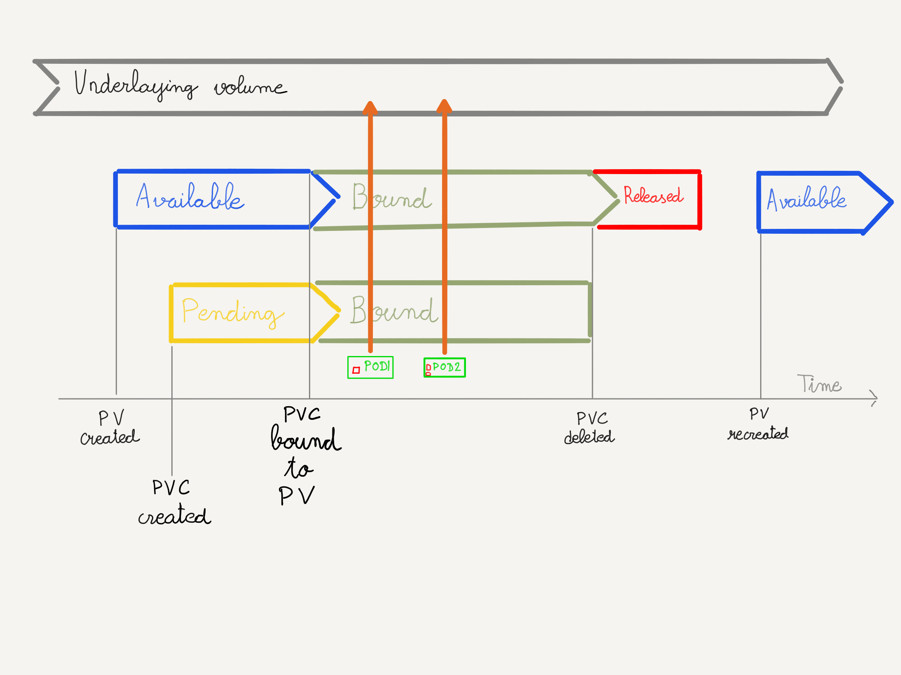

### Ciclo de vida de `PersistentVolume` y `PersistentVolumeClaim`

^^^^^^

##### Ciclo de vida de `PersistentVolume` y `PersistentVolumeClaim`

* Se crea el volumen con antelación
* Se crea el `PersistentVolume` y se configura para que utilice el volumen creado antes
* El `PersistentVolume` pasa a estado `Available`
* Se crea un `PersistentVolumeClaim` que reclama un espacio de almacenamiento que 
  concuerda con el `PersistentVolume` creado. El `PVC` aparece en estado `Pending`
* `PersistentVolume` y `PersistentVolumeClaim` se conectan y pasan a estado `Bound`
* A partir de este punto, podemos tener varios `Pods` que montan el volumen suyacenter y acceden 
  a los datos almacenados en él
  
^^^^^^

##### Ciclo de vida de `PersistentVolume` y `PersistentVolumeClaim`

* El `PersistentVolumeClaim` se borra
* El `PersistenVolume` pasa a estado `Released`
* Se aplica la política definida en `spec.persistentVolumeReclaimPolicy`
  * `Delete`: se borra el volumen y el `PersistentVolumeClaim`
  * `Retain`: ambos se mantienen. El objeto `PersistentVolume` no se puede utilizarç
  * `Recycle`: OBSOLETO Utilizar aprovisionamiento dinámico en su lugar

notes:

Si se borra el objeto `PersisntentVolume`, el volumen subyacente no se borra. El adminsitrador
puedo crear un nuevo `PersisntentVolume`, que estará en estado `Available` una vez creado,
y utilizarlo para reclamar el volume en un `Pod` y borrar los datos. Una vez hecho esto,
puede volver a borrar el `PersistentVolume` y crearlo de nuevo para que el volumen
subyacente, ahora ya limpio, pueda volver a utilizarse

^^^^^^

##### Ciclo de vida de `PersistentVolume` y `PersistentVolumeClaim`

El ciclo de vida descrito es aplicable a los `PersistentVolumes` creados con
antelación

Los `PersistentVolumes` creados dinámicamente tienen un ciclo de vida diferente
que veremos en la siguiente sección