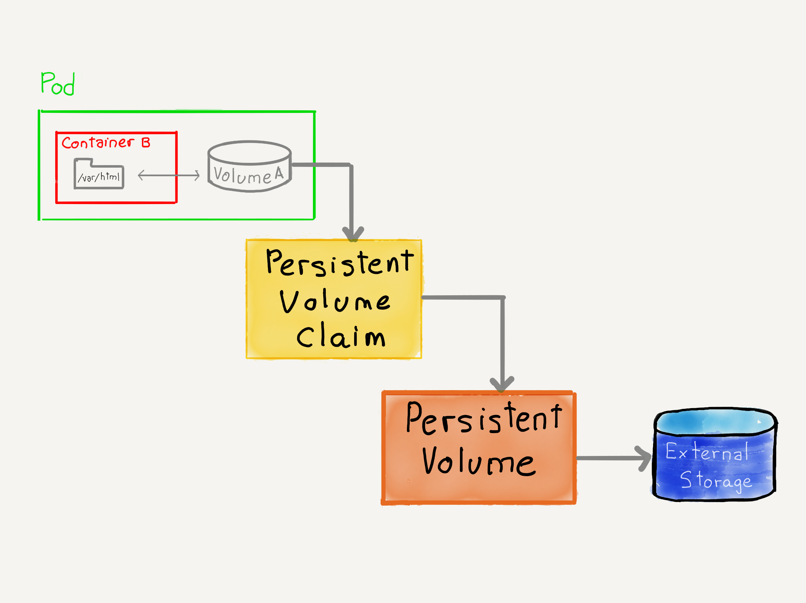

### `PersistentVolumes`



notes:

Estas dos capas de abstracción permiten separar los roles en la gestión del almacenamiento de un cluster

Por una parte los administradores del cluster se encargarán de crear los volúmenes usando las tecnologías a su disposición
(`iscsi`, `fc`, `glusterfs`, etc) así como de configurar el aprovisionamiento dinámico.

Los desarrolladores acceden a los volúmenes realizando solicitudes del tipo "quiero un volumen de 50G de tipo rápido".

De esta forma, el desarrollador y la aplicación no necesitan conocer los detalles de almacenamiento del cluster, que
queda en manos de los administradores.

^^^^^^

### `PersistentVolumes`


Objeto de la API de kubernetes que representa un Volumen

**Extrae la información del volumen fuera de la especificación del `Pod`**

```yaml
apiVersion: v1
kind: PersistentVolume
metadata:
  name: test-pv
spec:
  accessModes:
  - ReadWriteOnce
  capacity:
    storage: 10Gi
  csi:
    driver: cloud.ionos.com
    fsType: ext4
    volumeAttributes:
      datacenterID: 3914a457-f19b-4bba-8742-b21fa61d4521
    volumeHandle: datacenters/3914a457-f19b-4bba-8742-b21fa61d4521/volumes/97bb6e8e-6bce-4039-8be1-7baf734b3e66
  nodeAffinity:
    required:
      nodeSelectorTerms:
      - matchExpressions:
        - key: enterprise.cloud.ionos.com/datacenter-id
          operator: In
          values:
          - 3914a457-f19b-4bba-8742-b21fa61d4521
  persistentVolumeReclaimPolicy: Delete
  storageClassName: ionos-enterprise-hdd
  volumeMode: Filesystem
```

notes:

En este ejemplo vemos cómo definimos un `PersistentVolume` utilizando el driver `csi` en un 
cluster gestionado por IONOS.

^^^^^^

### `PersistentVolumes`

```yaml
apiVersion: v1
kind: PersistentVolume
metadata:
  name: task-pv-volume
  labels:
    type: local
spec:
  storageClassName: manual
  capacity:
    storage: 10Gi
  accessModes:
    - ReadWriteOnce
  hostPath:
    path: "/mnt/data"
```

⚠️`HostPath` sólo desarrollo y testing. No soportado en cluster con múltiples nodos.


notes:

En este ejemplo, definimos un `PersistentVolume` de utilizará la la carpeta `/mnt/data` del nodo
en el que se cree.

^^^^^^

### `PersistentVolumes`


```shell
$ gcloud compute disks create uploaded-files
```

```yaml
apiVersion: v1
kind: PersistentVolume
metadata:
  name: uploaded-files
spec:
  capacity:
    storage: 1Gi
  accessModes:
  - ReadWriteOnce
  - ReadOnlyMany
  gcePersistentDisk:
    pdName: uploaded-files
    fsType: ext4
```

notes:

Ejemplo de definición de un `PersisntentVolume` que utiliza `gcePersistentDisk`.

[Más información aquí](https://kubernetes.io/docs/reference/kubernetes-api/config-and-storage-resources/persistent-volume-v1/#persistent-volumes)
en la sección `gcePersistentDisk`

^^^^^^

### `PersistentVolumes`

* `spec.accessModes`: modos de acceso soportado por este volumen
* `spec.capacity.storage`: Tamaño del volumen
* `spec.volulmeMode`: `Filesystem` o `Block`
* `spec.persistentVolumeReclaimPolicy`: qué hacer cuando el _claim_ libera el volumen (`Delete`, `Retain`)
* `spec.storageClassName`: nombre de la clase de almacenamiento que se utilizará (se puede dejar en blanco)
* Tipo de volumen: `spec.csi`, `spec.awsElasticBlockStore`, etc

note:
`spec.accessModes`: los veremos en las próximas diapostivas

[La propiedad `spec.capacity`](https://kubernetes.io/docs/concepts/storage/persistent-volumes/#capacity) sólo admite
el tamaño del almacenamiento en este momento. En un futuro podria incluir IOPs, _throughput_ u
otras propiedades

`spec.volulmeMode`:
* `Filesystem`: el `PersistentVolume` se montará como una carpeta dentro del contenedor. Este es
  el comportamiento por defecto. El tipo de sistema de ficheros se configura como un parámetro
  dentro del tipo de volume, por ejemplo `spec.gcePersistentDisk.fsType`
* `Block`: El `PersistentVolume` se expondrá a los contenedores como un dispositivo de bloques

`spec.persistentVolumeReclaimPolicy` indica qué ocurrirá con el `PersistentVolume` cuando el `PersistentVolumeClaim` 
ibere el volumen:
* [`Delete`](https://kubernetes.io/docs/concepts/storage/persistent-volumes/#delete): el volumen se borrará 
* [`Retain`](https://kubernetes.io/docs/concepts/storage/persistent-volumes/#retain): el volumen se mantendrá y 
  deberá ser el administrador el que lo borre (valor por defecto)
* [`Recycle`](https://kubernetes.io/docs/concepts/storage/persistent-volumes/#recycle): permite reutilizar un `PersistentVolume`.
  Se ha marcado como obsoleto y la forma recomendada de reutilizar volúmenes es mediante aprovisionamiento dinámico (que veremos más
  adelante en este módulo)

`spec.storageClassName`: Se puede dejar en blanco si un `PersistentVolume` no pertenece a ninguna clase. Por ejemplo,
cuando usamos _host storage_ o se aprovisionan los volúmenes dinámicamente.

Los diferentes tipos de volúmenes, junto con sus propiedades, 
[pueden verse aquí](https://kubernetes.io/docs/reference/kubernetes-api/config-and-storage-resources/persistent-volume-v1/#persistent-volumes)

^^^^^^

### `PersistentVolumes`: Modos de acceso

* `ReadWriteOnce` (`RWO`): Sólo un nodo puede montar el modo en modo lectura escritura
* `ReadOnlyMany` (`ROX`): Múltiples nodos pueden montar el volumen en modo lectura
* `ReadWriteMany` (`RWX`): Múltiples nodos pueden montar el volumen en lectura escritura
* `ReadWriteOncePod` (`RWOP`): Sólo un nodo puede montar el volumen en modo lectura escritura.
  (sopoerte: `csi` y kubernetes >= 1.22)

notes:

^^^^^^

### `PersistentVolumes`: `StorageClass`


Objeto de Kubernetes que permite a los administradores de un cluster describir las clases de almacenamiento
que ofrecen

```shell
$ kubectl get storageclasses
NAME                             PROVISIONER       RECLAIMPOLICY   VOLUMEBINDINGMODE      ALLOWVOLUMEEXPANSION   AGE
ionos-enterprise-hdd (default)   cloud.ionos.com   Delete          WaitForFirstConsumer   true                   63d
ionos-enterprise-ssd             cloud.ionos.com   Delete          WaitForFirstConsumer   true                   63d
```

^^^^^^

### `PersistentVolumes`: `StorageClass`

* _Provisioner_: plugin utilizado para aprovisionar los volúmenes
* _Reclaim Policy_: cuando se aprovisionan dinámicamente, este será el valor por defecto
  para la propiedad `spec.persistentVolumeReclaimPolicy`
* _Allow volume expansion_: se permite ampliar dinámicamente el objeto `PersistentVolume`

[Más información sobre `StorageClass`](https://kubernetes.io/docs/concepts/storage/storage-classes/)