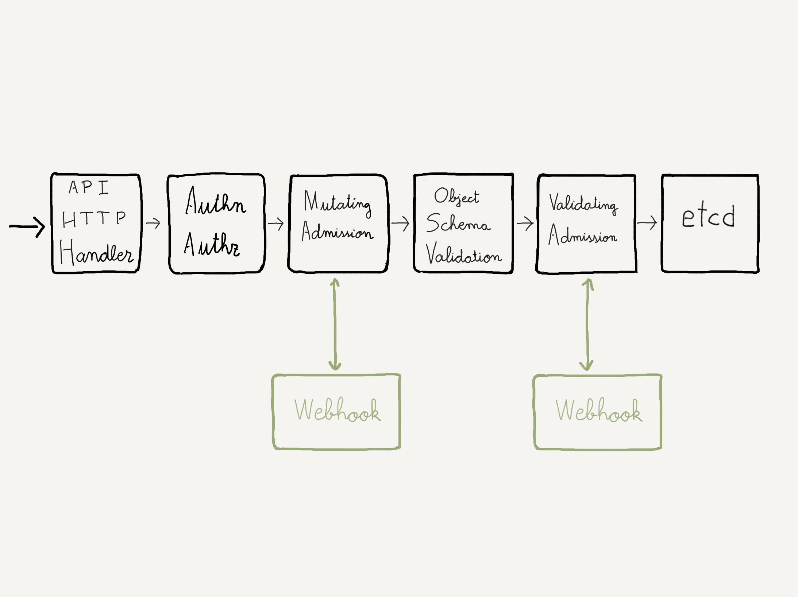

### _Admission controllers_

Controladores que **interceptan peticiones antes de que se persistan en el _backend_**

Las peticiones se interceptan
* **después** de que el usuario se ha autenticado
* **después** de que se ha autorizado la petición (usando RBAC)
* **antes** de que la petición se almacene en el _backend_ (`etcd`)

^^^^^^

### _Admission controllers_

Se activan cuando se crea el cluster.

Se activan pasando un parámetro al comando `kube-apiserver`

```shell
$ kube-apiserver --enable-admission-plugins=NamespaceLifecycle,...
```
La lista de _admission controllers_ que se activa por defecto depende de
la versión de Kubernetes que estemos utilizando

notes:

Si vamos [a la documentación de `kube-apiserver`](https://kubernetes.io/docs/reference/command-line-tools-reference/kube-apiserver/) 
y buscamos los parámetros  `--enable-admission-plugins` / `--disable-admission-plugins`, 
veremos la lista de _admission controllers_ que están activos por defecto:

> NamespaceLifecycle, LimitRanger, ServiceAccount, TaintNodesByCondition, PodSecurity, Priority, 
> DefaultTolerationSeconds, DefaultStorageClass, StorageObjectInUseProtection, 
> PersistentVolumeClaimResize, RuntimeClass, CertificateApproval, CertificateSigning, 
> CertificateSubjectRestriction, DefaultIngressClass, MutatingAdmissionWebhook, 
> ValidatingAdmissionWebhook, ResourceQuota

^^^^^^

### _Admission controllers_

**NamespaceLifecycle**: Impide que se creen objetos en un `Namespace` cuando este pasa 
al estado `Terminating`

**LimitRanger**: intercepta una petición para crear un `Pod` y se asegura de que esta tenga
unos valores mínimos por defecto para el uso CPU, memoria y almacenamiento
([Limit Ranges](https://kubernetes.io/docs/concepts/policy/limit-range/))


^^^^^^

### _Admission controllers_

**DefaultStorageClass** Si se crea un `PersistentVolumeClaim` que no define un _storage class_,
este controlador modifica la petición y le añade el valor por defecto

**DefaultTolerationSeconds** Añade un valor por defecto a los `tolerations` definidos en un 
`Pod` si estos no lo definen

^^^^^^

### _Admission controllers_

**MutatingAdmissionWebhook** Interceptan la petición y llama a un **Webhook** (programa
que se puede estar ejecutando en un `Pod`)

El _webhook_ puede modificar la petición **antes de que esta llegue al API Server**

Por ejemplo, podemos inyectar un contenedor en todos los `Pods` que se crean en nuestro cluster

^^^^^^

### _Admission controllers_

**ValidatingAdmissionWebhook** Intercepta la petición y llama a un **Webhook** (programa
que se puede estar ejecutando en un `Pod`)

Podemos analizar la petición antes de que esta llegue al API Server. Si el controlador
rechaza la petición, esta fallará antes de llegar al API Server.

Por ejemplo: validar que los `Deployments` siguen un determinado esquema de nombres

^^^^^^

### _Admission controllers_




^^^^^^

### _Admission controllers_

[Using Admission Controllers](https://kubernetes.io/docs/reference/access-authn-authz/admission-controllers/)