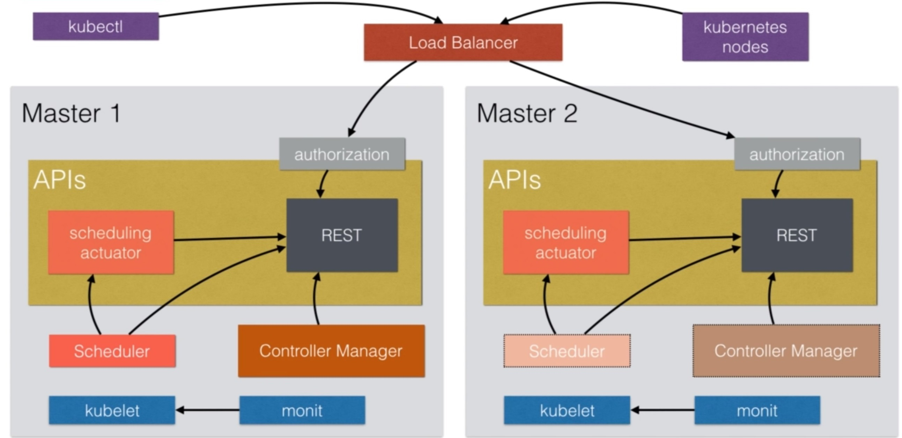

### Alta disponibilidad

Un cluster en producción requiere que todos los servicios del _control plane_
estén en una **configuración de alta disponibilidad**

* **Cluster etcd** de al menos tres nodos
* Varias réplicas del API Server con un `LoadBalancer`
* Ejecutar varias instancias del `kube-schduler` y de los diferentes `controllers`
  * Una instancia será la _leader_ y las otras estarán en espera (_fail over_)

^^^^^^

### Alta disponibilidad

notes:

Sólo podemos tener una instancia de `kube-scheduler` y del `controller manager`.
Por eso en el segundo nodo aparecen con un tono más opaco.

^^^^^^

### Alta disponibilidad

Herramientas como `kops` o `kubeadm` nos ayudan a generar esta configuración.

[Creating Highly Available Clusters with kubeadm](https://kubernetes.io/docs/setup/production-environment/tools/kubeadm/high-availability/)